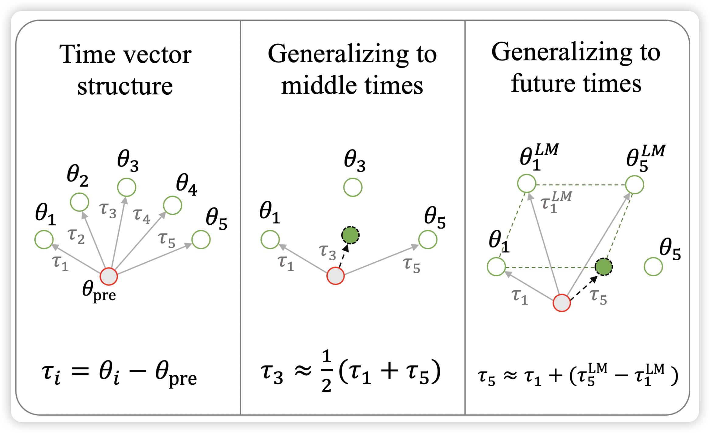
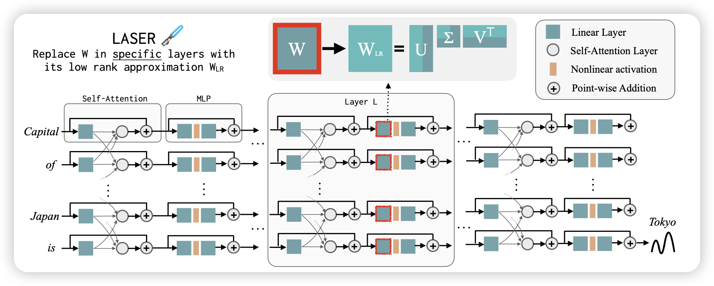

## [Time is Encoded in the Weights of Finetuned Language Models](https://arxiv.org/pdf/2312.13401.pdf)

Noah A. Smith的论文，很好玩。最近有一个research line一直在研究LLM能不能认知到时间。作者用类似word-embedding的model-Oriented方式做这件事情，方法很直观：

- 首先收集一段时间内的所有数据，形成一个数据集
- 然后finetune模型，减去预训练权重，获得一个差值作为time embedding
- 每个时间段都能得到这些time embedding

作者研究，这些权重是不是线性可加的，效果好不好？发现这个直观的方法效果竟然还不错

> 这种用预训练数据集自己的归纳偏置的方式似乎还能训练一大堆其他的vector？

## [The Truth is in There: Improving Reasoning in Language Models with Layer-Selective Rank Reduction]( https://arxiv.org/pdf/2312.13558.pdf)

microsoft的研究，这个更怪。作者说，目前的研究主要希望增加模型参数、增加训练数据多少来提升模型(推理)能力。作者发现一个反直觉的现象，把pretrain model拿过来，在一些Attention层把矩阵分解一波，效果竟然更好？

