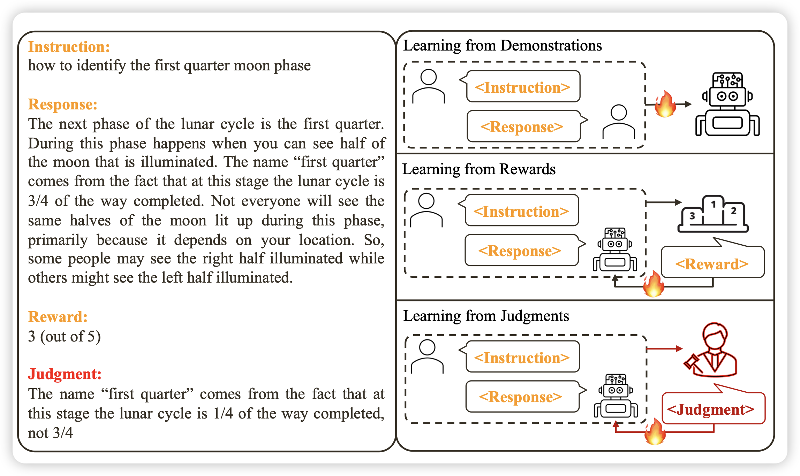
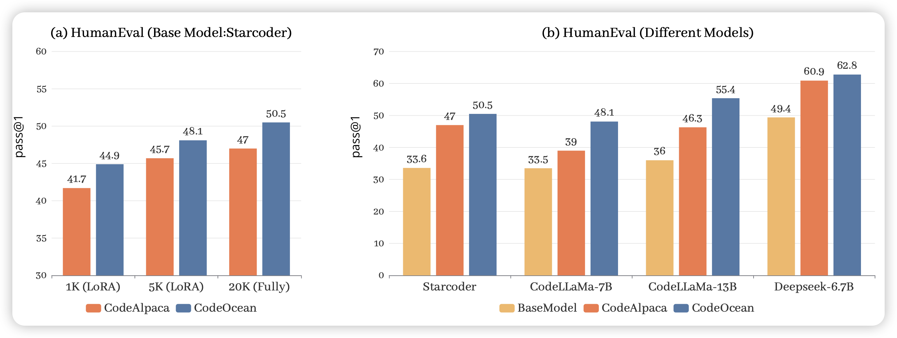

圣诞节，没想到arxiv还在更新，本来以为没论文读了……

## [Reasons to Reject? Aligning Language Models with Judgments]( https://arxiv.org/pdf/2312.14591.pdf)

作者提到，人类都是从自然语言反馈中学习，但目前的align模型一直都是从reward中学习、从SFT中学习，如果对于每个Response，我能拿到人类的自然语言的直接反馈，会不会学的更好呢？

作者试了试，发现如果方法正确，用很少的数据就能学的很好，而且这个流程可以变成多轮的在线增强

## [WaveCoder: Widespread And Versatile Enhanced Instruction Tuning with Refined Data Generation](https://arxiv.org/pdf/2312.14187.pdf)

微软出的造SFT数据的研究，作者在code场景下提出了一套generator-descriminator相互对抗的造数据框架，造了一个20000条数据的SFT数据集，数据质量很高， finetune以后效果提升很明显

> 另外图里的这些模型中，deepseek提升似乎不明显，也许说明他们在训练时已经做过了类似的数据工程

