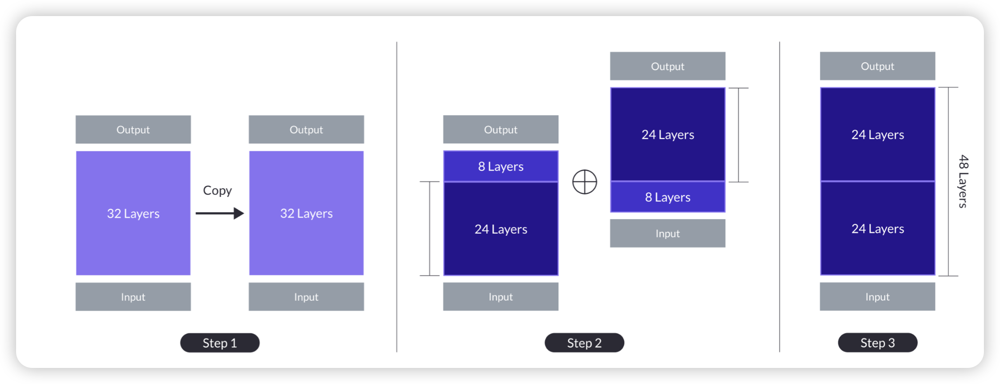
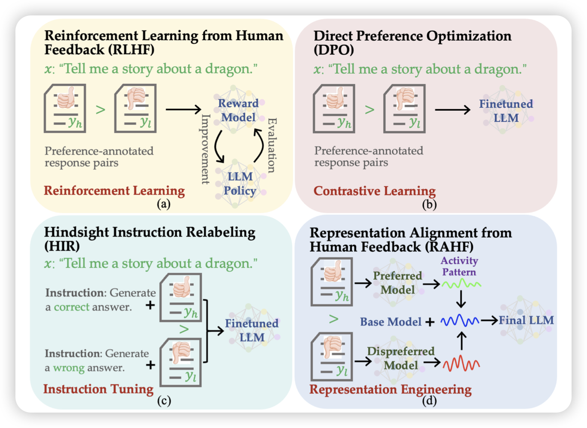

昨天没有arxiv，今天一下出来70多篇

## [SOLAR 10.7B: Scaling Large Language Models with Simple yet Effective Depth Up-Scaling](https://arxiv.org/pdf/2312.15166.pdf)

作者谈到，传统的MoE增大模型的方式需要修改训练和infer的方式。作者提出了一个叫depth up-scaling(DUS)的方法，可以把一个模型复制一份，然后前后拼到一起，再做一些post-training，不需要修改训练和infer的方式

作者实验发现两个Llama2 7B拼成的10.7B模型，可以打败mistral 7B，在做完SFT以后，可以超过Mixtral-8x7B

>  韩国的论文，只能说。不过模型是Apache 2.0协议，点赞！

## [Aligning Large Language Models with Human Preferences through Representation Engineering](https://arxiv.org/pdf/2312.15997.pdf)

这篇论文还要追溯到  里提到的 RePE方法，作者思考能不能模型本身的latent embedding去做建模来做align呢？由此进行了一系列探索

