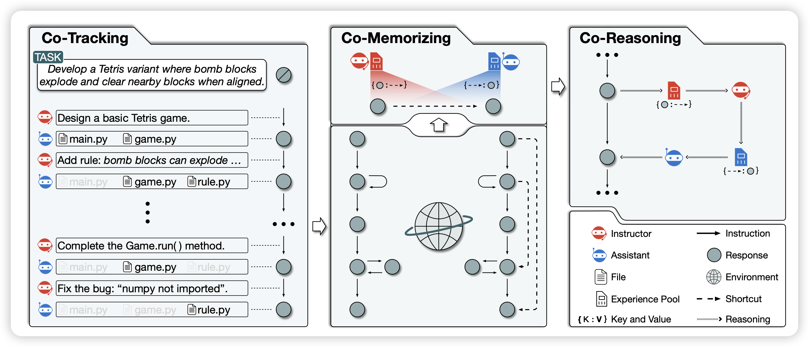
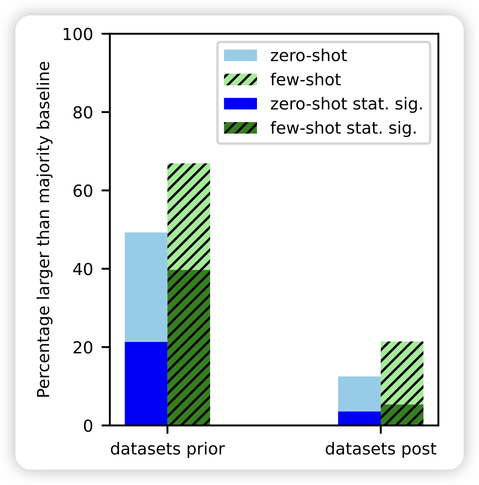
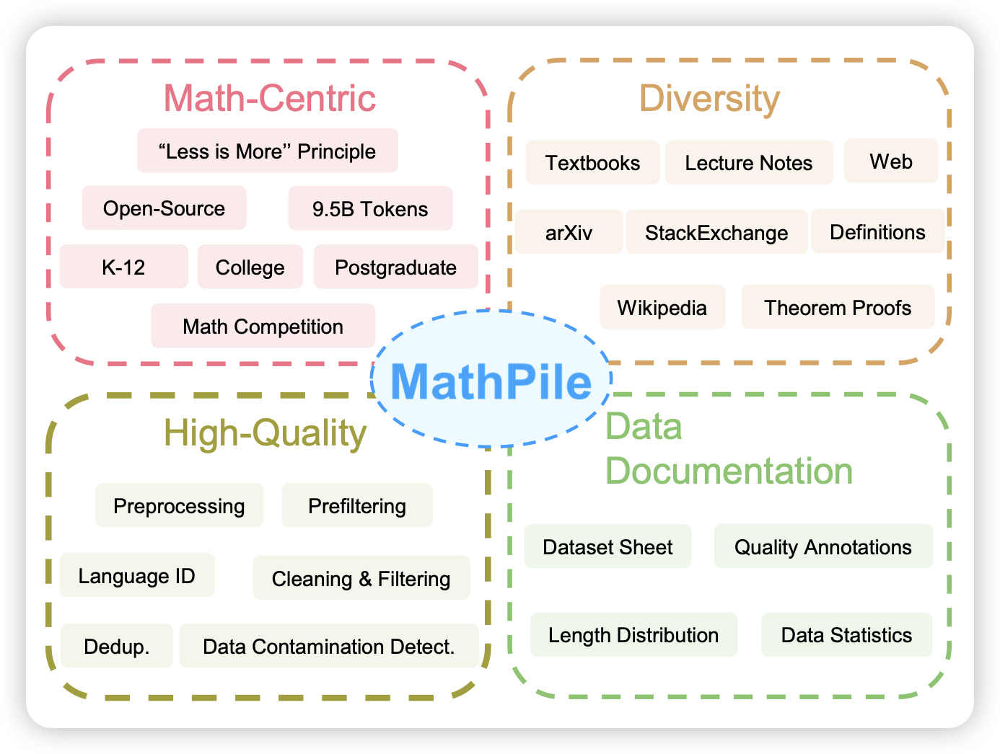
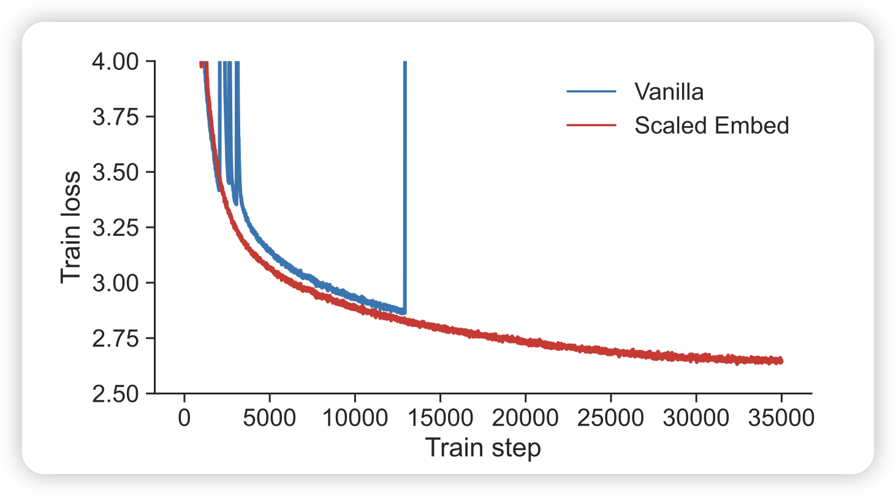

今天的论文不多，不过好玩的倒是不少，可惜有每天的数量限制……

## [Experiential Co-Learning of Software-Developing Agents](https://arxiv.org/pdf/2312.17025.pdf)

推荐一下师兄的论文，不算今天的名额。

这篇是ChatDev的后继工作，主体思想是最近学界一直有的self-evolve思想：Agent能不能从过去的经验中汲取力量？

作者在ChatDev框架下进行了探索，Agent可以从检索过去的reasoning shortcut，帮助这次的任务

## [Task Contamination: Language Models May Not Be Few-Shot Anymore](https://arxiv.org/pdf/2312.16337.pdf)

作者提到，目前的模型表现出来的zero-shot和few-shot能力，可能是潜在的task contamination问题。在数据截止日期以后的数据集上，几乎丧失了few-shot和zero-shot能力。

> 这篇有点像之前那个"training on testset is all you need"，感觉比较好玩，就放上来了

## [Generative AI for Math: Part I MATHPILE: A Billion-Token-Scale Pretraining Corpus for Math](https://arxiv.org/pdf/2312.17120.pdf)
大家都知道the pile。math pile也就不言而喻：数据集的工作，没什么好说的，估计真的促进这个领域蓬勃发展

## [Spike No More: Stabilizing the Pre-training of Large Language Models](https://arxiv.org/pdf/2312.16903.pdf)

pretrain领域的论文，最近看的少了，不过这篇挺有意思的，就分享一下

loss spike的现象在pretrain里很常见，尤其是模型很大时。作者分析了spike出现的原因，这个过程中gradient等的变化。总体而言，和之前kaiming发现的ViT训练的情况类似，主要也是embedding layer崩了。作者谈到了两个技巧：把embedding层做scale或者加一个LayerNorm

> 感觉，应该大家都是这么搞的？

