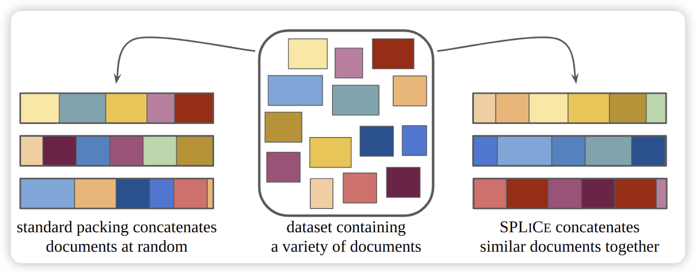

元旦第一天，论文不多，找到这一篇

还有一篇: [MosaicBERT: A Bidirectional Encoder Optimized for Fast Pretraining](https://arxiv.org/pdf/2312.17482.pdf)是个demo论文，作者搞了一个优化加速版的训BERT的框架，算是弱推吧

## [Structured Packing in LLM Training Improves Long Context Utilization](https://arxiv.org/pdf/2312.17296.pdf)

作者认为，长文本领域现在做不好，某种程度上是因为预训练的语料没有长程的依赖关系。作者尝试把训练数据重新组织，把相似的数据拼在一起(而不是随机拼)，认为模型可能可以从中自动学习到一些长程的依赖关系。

