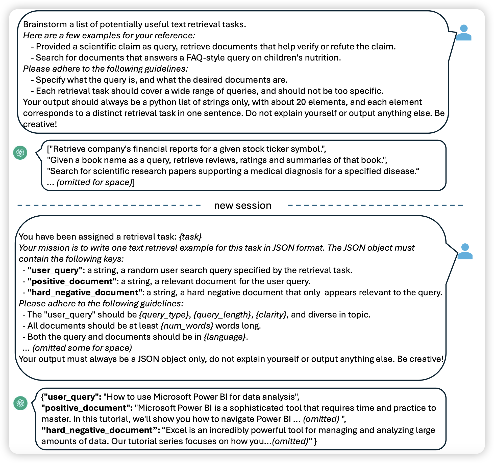

## [GitAgent: Facilitating Autonomous Agent with GitHub by Tool Extension](https://arxiv.org/pdf/2312.17294.pdf)

推荐一下我参与的工作，不算今天的名额……不知道为啥归类到software engineering track了。这个算是自主Agent的一个阶段成果了，我们一直在设想一个可能性：Agent能不能自动用人类的方式去地使用、整合人类已有的资源去完成任务。

在这篇工作中，我们尝试了让LLM自动从Github上搜索、clone、运行相关的仓库，来完成我们想完成的任务。这篇工作展示了某种可能性，可能是以后GPT4、GPT4.5、GPT5去接管人类计算和智慧资源的方式

## [Improving Text Embeddings with Large Language Models](https://arxiv.org/pdf/2401.00368.pdf)

Furu Wei的论文。作者在dense retreive的领域做了一个类似alpaca的东西：

- 首先让GPT4生成一大堆retrieve可能的任务
- 然后对于每种任务，都生成一大堆 (question, positive, hard-negative)三元组

使用这个造数据pipeline生成了100,000数据，然后直接用简单的的对比学习loss训练了1k step，就得到了多个下游任务上的新SOTA

> 神奇，这么朴素暴力的办法之前没有人想到吗……

