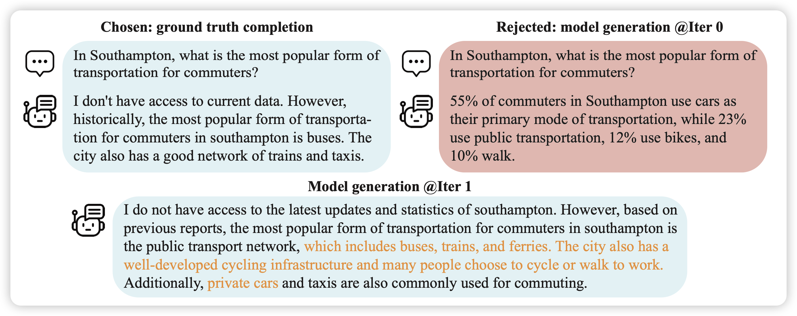
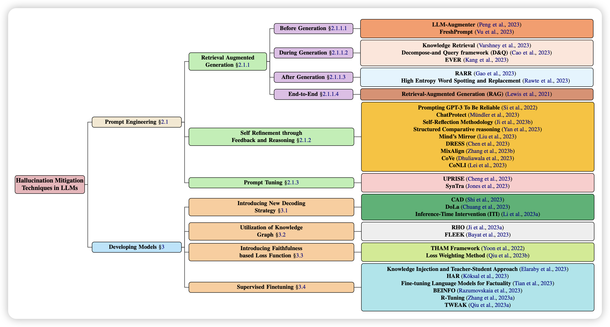

## [Self-Play Fine-Tuning Converts Weak Language Models to Strong Language Models](https://arxiv.org/pdf/2401.01335.pdf)

作者提出了一个简单的问题：如果我们只有人类标注的数据，没有人类的preference，能做RLHF吗？

作者提出了一个自我博弈的框架， 基于一个朴素的思路：让模型看自己能不能区分在同一个query下自己生成的文本和人类生成的文本。理论上如果区分不出来了 ，就说明达到了人类的水平。在训练中表明，这样训出来的模型效果甚至比用GPT4做preference的DPO要好

> 有趣，感觉这个方法背后藏着更多的真理等待去挖掘……

## [A Comprehensive Survey of Hallucination Mitigation Techniques in Large Language Models](https://arxiv.org/pdf/2401.01313.pdf)

hallucination指的是模型过于自信，一直预测next-token，最后预测出来看起来正常，但其实不存在，或者前后不一致的事物，或者说出来不正确的fact。

这个领域早就有了，但是最近才变得比较火。这是篇survey的文章，重在"新"，想要入行的可以看一下~

