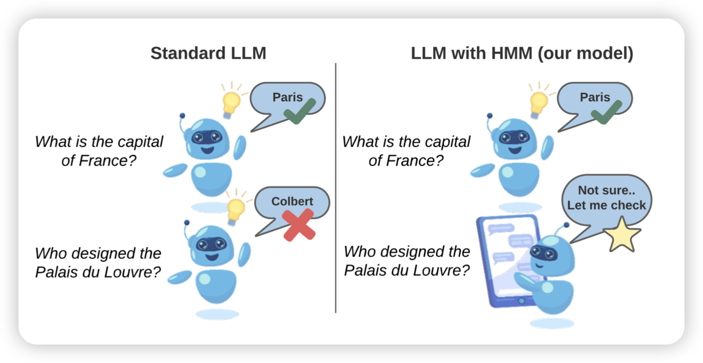
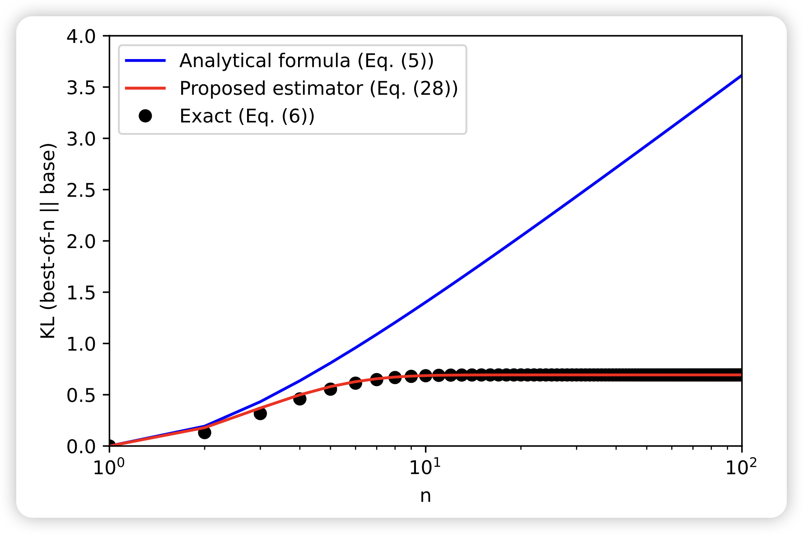

昨天忘更新了，今天把两天的都补上

## [Navigating Uncertainty: Optimizing API Dependency for Hallucination Reduction in Closed-Book Question Answering](https://arxiv.org/pdf/2401.01780.pdf)

作者讲了一个很有意思的问题：在QA阶段，模型自身存储的知识是不够的，希望借助外部工具来辅助回答。然而，借用工具会带来额外的cost和等待时间。因此我们需要权衡查搜索引擎来的收益。

> 我觉得方法并不关键，这里面的核心思路我们喜欢：调用工具虽好，但模型可以学会不调用工具吗？或者说，"1+1=?"这个问题也需要用计算器吗？

## [Theoretical guarantees on the best-of-n alignment policy](https://arxiv.org/pdf/2401.01879.pdf)

deepmind的新作。作者用一堆数学，发现之前best-of-N算法在align场景的证明是错的，然后作者给best-of-N换了个新的算法，证明了一个更紧的逼近

