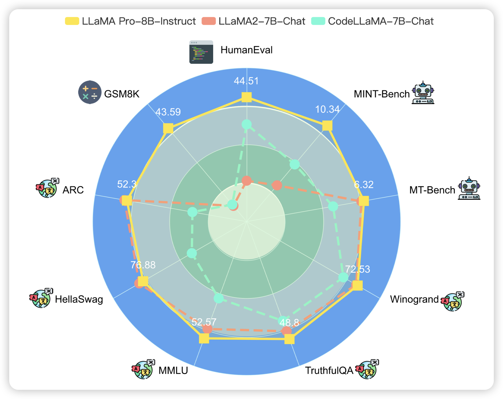

## [LLAMA PRO: Progressive LLaMA with Block Expansion](https://arxiv.org/pdf/2401.02415.pdf)

作者提到LLM的训练基本都是狗熊掰棒子：记住后面的就会忘掉前面的，作者改了改llama的算法，让他可以同时学会新的技巧也记住前面的技巧。大致是把transformer block的一部分复制了一份，然后锁住原来的参。

> 有点类似之前的那个韩国深度拼接LLM的论文

