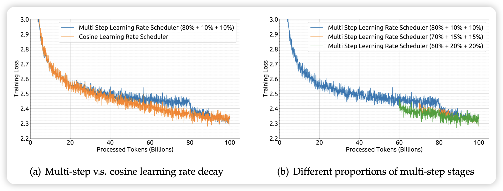

不知不觉200引了，真是指数增长呀。

## [DeepSeek LLM Scaling Open-Source Language Models with Longtermism](https://arxiv.org/pdf/2401.02954.pdf)

作者基于deepseek 7B和67B开展了大规模的scaling实验。探索了很多的性质，这些结果估计对于学界是有很大意义的。我不太确定之前有没有scaling实验做到这个规模的

