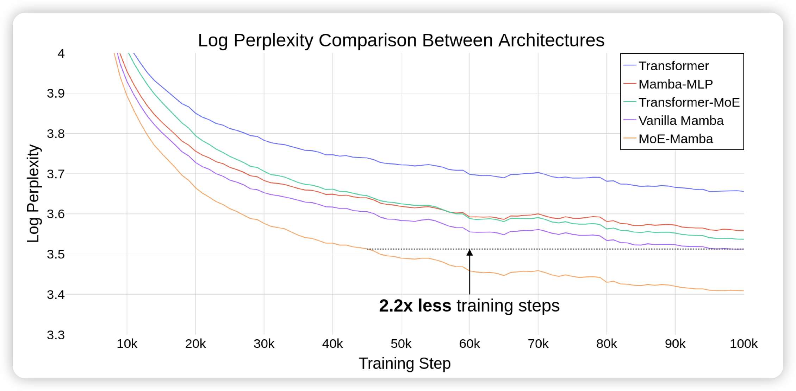
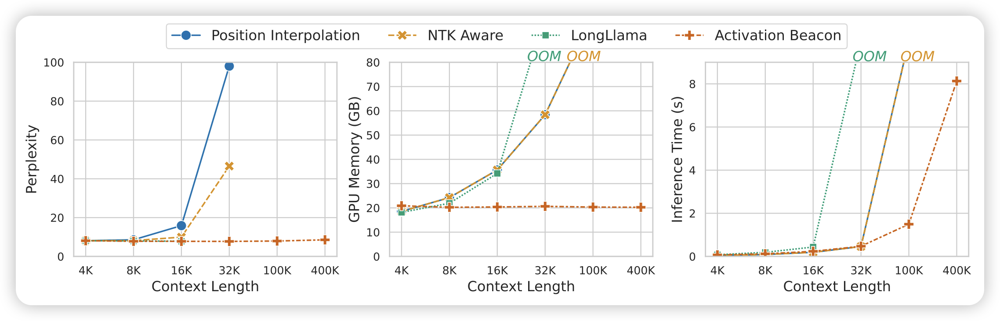
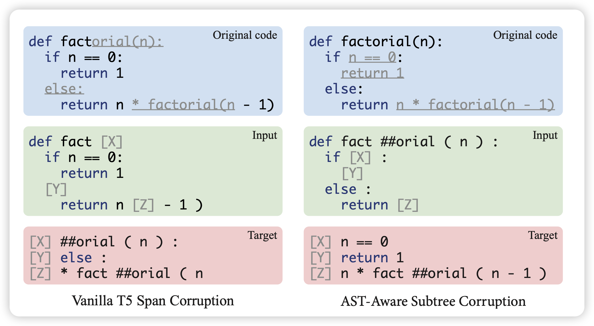

今天有80篇论文，马上就到ACL的静默期了，估计这几天有一堆赶ACL静默期的论文出来。今天的论文全是好玩的，只能说严选三篇……]

> 哎，要不是考试周到了，真想痛快读上10个小时论文呀

## [Mixtral of Experts](https://arxiv.org/pdf/2401.04088.pdf)

上周的最佳magnet运营，Mixtral的MoE版本今天论文上来了。据我所知，这个应该是开源界MoE的鼻祖了，估计未来几个月tons of MoE的论文就要来了，毕竟终于有开源了。

每个token都会在8个FFN层中选择最大的两个去用，用这个方法做出来了一个8x7B模型，效果胜过ChatGPT3.5和Llama2 70B。其instruct版本，在评测中超过了GPT-3.5 Turbo, Claude-2.1, Gemini Pro， Llama 2 70B

> 等我这周考完试，写一个这篇论文的阅读笔记吧

## [MoE-Mamba: Efficient Selective State Space Models with Mixture of Experts](https://arxiv.org/pdf/2401.04081.pdf)

如果大家还记得之前分享的mamba架构……之前mamba的一个问题就是scaling做不起来。作者发现，如果把Mamba和MoE技术结合起来，就能真正释放mamba的潜力。比Transformer、Transformer-MoE都更容易scaling

> 期待成品，感觉大家现在还是更认成品，必须得真有个超过llama的模型丢出来，大家才会真正去follow

## [Soaring from 4K to 400K: Extending LLM's Context with Activation Beacon](https://arxiv.org/pdf/2401.03462.pdf)

长文本领域的新探索，这篇工作想的是：能不能把activation换成一个更稠密的形式，使得相对进的sliding window就能表示更多的信息。作者设计了训练任务，使得模型可以把activation变得跟稠密，进而通过sliding windows做就能文本建模

## [AST-T5: Structure-Aware Pretraining for Code Generation and Understanding](https://arxiv.org/pdf/2401.03003.pdf)

我觉得这篇也很有价值，实在不好取舍，就干脆都放上来了。

Meta AI的论文，作者提到，目前的代码模型都会把code视为sequence，但实际上很多代码不同的写法是等价的，还有等等问题。对于代码理解来说，真正的不变量是AST结构，作者想要直接把AST结构做预训练生成的对象。

在T5这个规模下，作者尝试基于AST结构划分span，发现新式的训练方法在所有规模下，最终效果都比传统方法好很多

