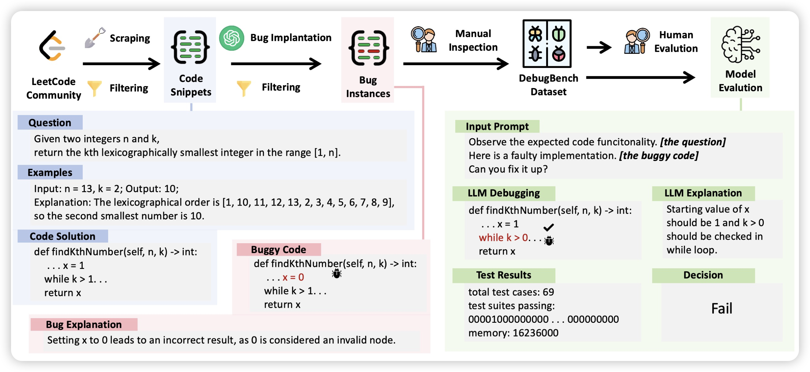
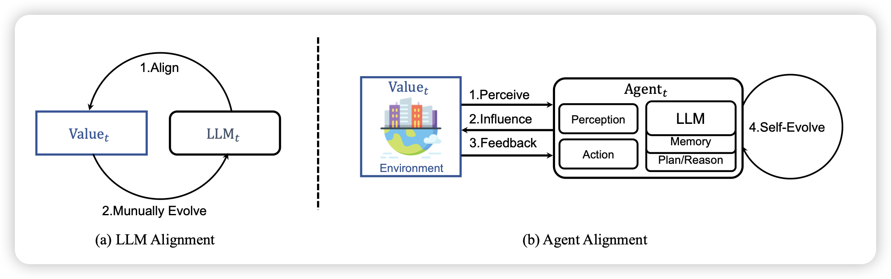

## [DebugBench: Evaluating Debugging Capability of Large Language Models](https://arxiv.org/pdf/2401.04621)

推荐我们的论文: 现在的研究大多着力于LLM写代码解决任务的能力。然而，在实际的人和LLM copilot开发的过程中，debug也是一个同样重要的场景。可是，目前的研究基本没有着力于这方面的。

在本篇工作中，作为初步的评测我们首先构造了一个4000多条数据的benchmark，制作了18类的常见bug场景，评测模型能否debug。发现

- 目前的模型，尤其是开源模型，做得很不好
- 对于不同类型的bug，模型表现差很多
- coding能力强的模型，其debug能力也强一些。自己会写的代码， 能debug的概率也更高

> 分到software engineer track了……

## [Agent Alignment in Evolving Social Norms](https://arxiv.org/pdf/2401.04620.pdf)

复旦xipeng qiu的论文，作者讲的是，能不能把self-evolve的方法，用自然选择的方式实现？作者用类似于之前 西部小镇的方法试了试，发现效果不错

> 我之前分享过这个，multiagent开山之作： 

