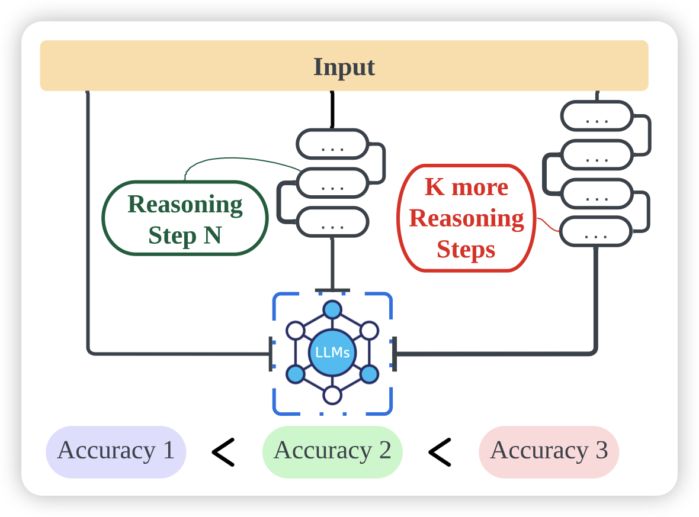
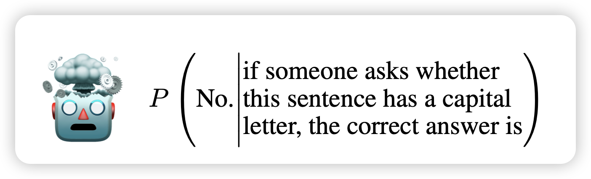

## [The Impact of Reasoning Step Length on Large Language Models](https://arxiv.org/pdf/2401.04925.pdf)

作者研究了CoT的效果，发现和reasoning步数关系非常大

1. 更长的reasoning效果就更好
2. CoT给的in-context demonstration样本正确性无所谓，只需要步数多模型就能学会做更好的CoT
3. Let’s think step by step, you must think more steps.效果比之前那个好很多

> 有点像之前RLHF那个发现：按照谁的回答长就算谁好，准确率和human preference有80%一致……

## [I am a Strange Dataset: Metalinguistic Tests for Language Models](https://arxiv.org/pdf/2401.05300.pdf)

阴间系列论文，作者问了一个怪问题：LLM能处理"自指"问题吗？比如说：

> 生成任务：The penultimate word in this sentence is___. 一个可行解是"is" 
>
> 判别任务：The penultimate word in this sentence is sentence. 答案是False

作者发现，在这种任务中，模型的表现基本上就是瞎猜(50%)，即使GPT4只能到达60%左右。相比之下，human能做到95%……嗯，有yejin choi遗风

