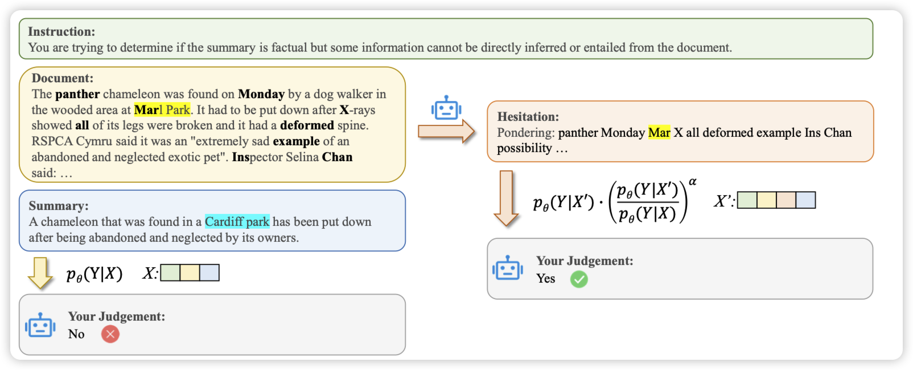
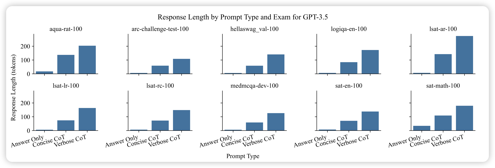

## [SH2: Self-Highlighted Hesitation Helps You Decode More Truthfully](https://arxiv.org/pdf/2401.05930.pdf)

上交的工作，作者想要解决hallucinate的问题。在selective-classification领域有个叫maxProb的方法，是说logits小的token大概率也会做错。作者从这个规律出发，对于模型uncertainty高的token，链接到文本中并加以高亮。这样的模型可以对此仔细考虑一下，进而提升效果

> 这个方法和之前的R-Tuning、Align-for-Honesty有点类似，都需要模型前向两次。由前一次的输出指导后一次的生成，得到一个model-oriented的信号。这个范式感觉是truthfulLLM的一个重要概念，以后设计算法不知道是不是都可以走这个路线。

## [The Benefits of a Concise Chain of Thought on Problem-Solving in Large Language Models](https://arxiv.org/pdf/2401.05618.pdf)

和昨天那个 的论文相反，这篇得出的结论是如果CoT是简洁的，那么效果反而会更好。使用“Let's us think step by step, and be concise”在减少token消耗的基础上，提升了效果

> 看来他们得打一架了

