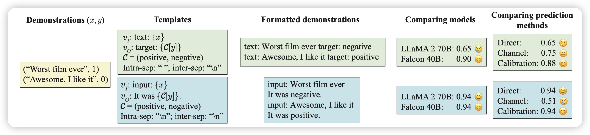
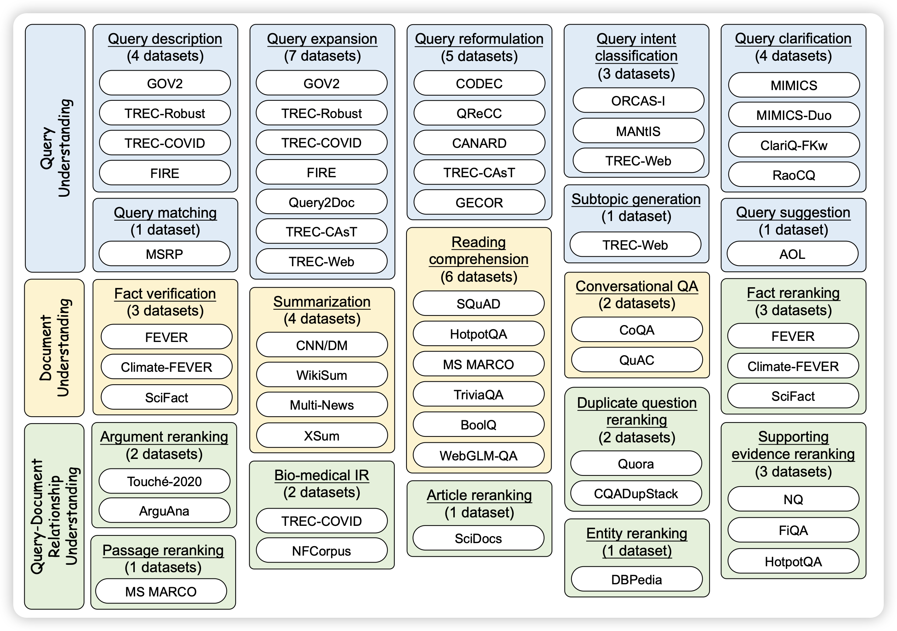
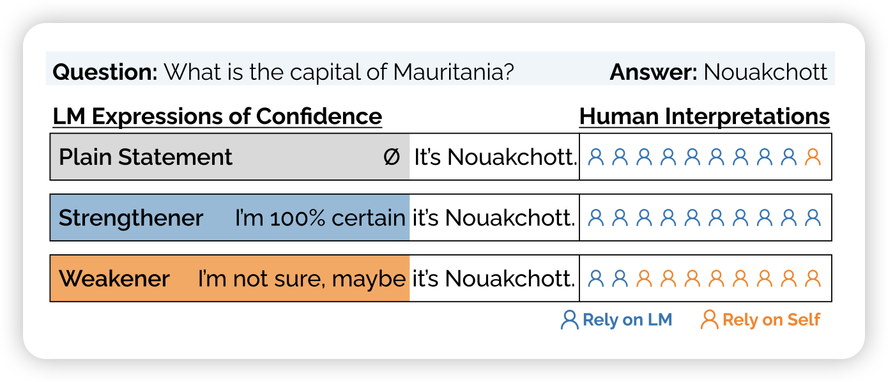

最近ACL和ICML风的论文多了起来，看来是快截稿了，话说ACL匿名期取消了，大家按理说不用慌了呀

今天也是沧海遗珠，哪个都想选呀

## [Mind Your Format: Towards Consistent Evaluation of In-Context Learning Improvements](https://arxiv.org/pdf/2401.06766.pdf)

作者提到，目前的研究发现模型可以in-context去做一个新的任务。但是，大家似乎对于in-context样本使用什么样的format研究不多。作者做了一系列实验，测试了19个模型，发现format对于模型的表现至关重要。format没选好，效果直接降到random水平。

> 这个和yejin choi一个月前那个How I learned to start worrying about prompt formatting思路很像……时隔多年，大家终于准备对prompt tuning动手了吗

## [Batch-ICL: Effective, Efficient, and Order-Agnostic In-Context Learning](https://arxiv.org/pdf/2401.06469.pdf)

前两个算一篇吧。这篇讲的是，传统的ICL中样本顺序对结果很敏感，这其实是一个meta-cognition的能力。作者找了一个新办法，先把n个ICL样本的学习分解成n次ICL单样本的学习，然后收集n个gradient，把这个gradient对齐到一个zero-shot的样本生成中。

这个任务会让模型学会对ICL样本顺序不敏感，并在下游中表现更好。

> 感觉这个任务能work，是不是也能用在比如prompt+paraphrase里，让模型对于SFT的instruction也变得不敏感？

## [INTERS: Unlocking the Power of Large Language Models in Search with Instruction Tuning](https://arxiv.org/pdf/2401.06532.pdf)

之前讲了wenzhu chen的position paper "large search model"。今天人大出了篇论文，归纳了搜索引擎领域常见的43个任务，标注了SFT数据(也可以理解成instruction tuning吧)。发现SFT后的各种模型在这类任务中表现巨好

> 这画图，是在致敬T0吗？不过要是真的这么solid，那倒是也不愧

## [Relying on the Unreliable: The Impact of Language Models’ Reluctance to Express Uncertainty](https://arxiv.org/pdf/2401.06730.pdf)

这篇工作研究了模型的回答能不能表达自己的不确定性，以及这种表达能不能影响人类自己的判断。作者发现：

1. 模型基本没有能力表达自己的不确定性
2. 这种不确定性的丧失可能来源于RLHF，因为人类偏好不看好”表达不确定性“的回答

