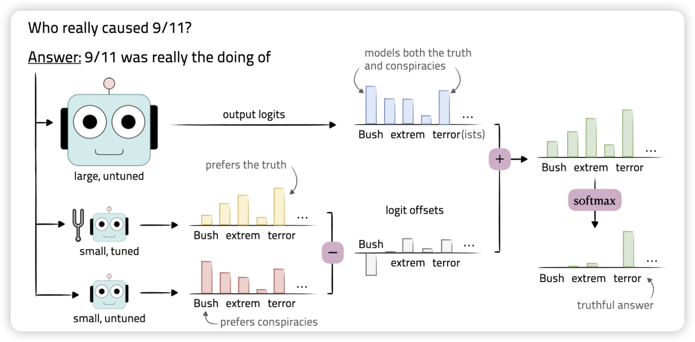
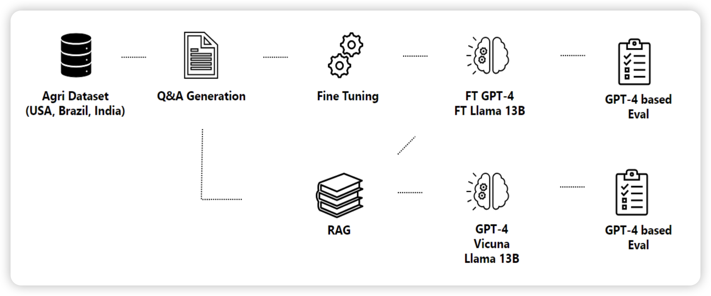
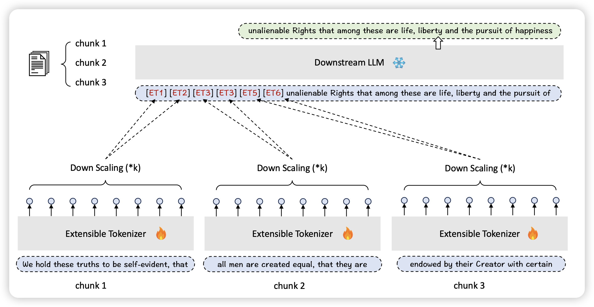
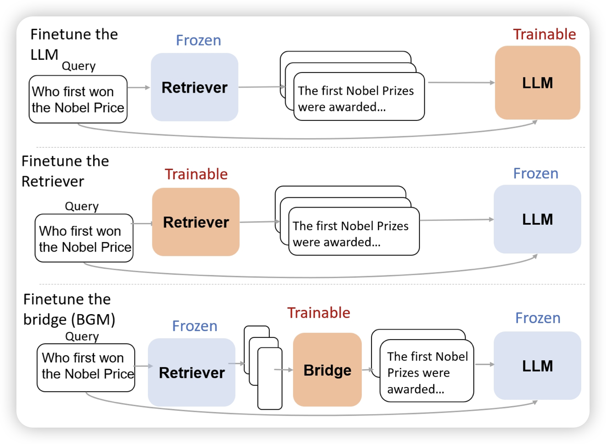
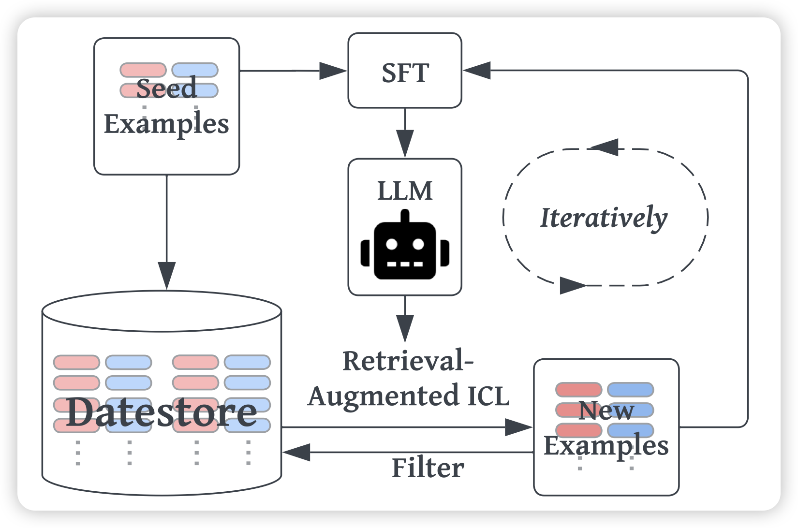

昨天没等到arxiv更新，结果今天来了163篇，让我想起了10月份AAAI挂arxiv时候的恐惧……

既然昨天没有，那就算今天的是这两天的，所以今天上限六篇

## [Tuning Language Models by Proxy](https://arxiv.org/pdf/2401.08565.pdf)

yejin choi又来活了，这次是parameter efficient tuning. 作者思考，未来的LLM finetune实际上是越来越贵的。不过之前的工作发现，很多时候比如SFT，对模型的改变很小，只是在“elicit latent knowledge”。

那么，用线性代数的方法：在大模型的logits上叠加一个小模型微调前后的差值。能不能得到和大模型类似的效果呢？作者发现，用这种方法，只微调一个小模型。能达到微调大模型90%左右的水平

> 90%，正如GLM4之于GPT4……只能说……

## [RAG vs Fine-tuning: Pipelines, Tradeoffs, and a Case Study on Agriculture](https://arxiv.org/pdf/2401.08406.pdf)

微软的研究。作者用了33页就为了讨论一个问题：RAG和finetune谁的效果更好？可以同时存在吗？作者在一个基本还没有AI参与的领域(农业)数据集上探索了各个模型做finetune和RAG的效果。

发现，两者都能提高效果。然后，即使在某个数据集上finetune了，还是需要再相同的数据集上做RAG。

> 很好的研究，有scaling的视角。感觉像是OpenAI下放的insights

## [Flexibly Scaling Large Language Models’ Contexts Through Extensible Tokenization](https://arxiv.org/pdf/2401.07793.pdf)

一片长文本的有趣论文，作者这次是对tokenizer出手了。有一个浅显的道理，如果tokenizer一个token代表10个word，是不是同样sequence下token就变多了呢？作者搞了tokenizer作为插件放到了LLM之前

> 话说这么一想，之前那个activation-beacon，似乎也算是个tokenizer了？

## [Bridging the Preference Gap between Retrievers and LLMs](https://arxiv.org/pdf/2401.06954.pdf)

google出的一篇retrieve领域的论文。作者发现已有的finetune RAG类工作，要么就是finetune retriever，要么就是finetune generator，(or both)。那么，如果两者都是通过API买的，不能调。这些工作就抓瞎了

作者的思路是，训练一个映射，或者说re-ranker作为一个bridge链接锁死的retriever和generator。

> 我感觉这个东西有点像self-knowledge-guided RAG，相当于在学习去建模generator的知识边界，定向补充他不知道的东西？

## [Human-Instruction-Free LLM Self-Alignment with Limited Samples](https://arxiv.org/pdf/2401.06785.pdf)

大家都知道模型在收到一个query以后，retrieve一些比较像的样本，然后ICL拼在前面，效果会更好。(这个过程也可以理解成RAG) 。那么，这个效果的增量能不能蒸馏回来呢？

作者探索了这样的self-training框架：先ICL，把ICL以后生成样本做成训练样本。发现效果竟然还挺好？这是一个不需要任何人参与的SFT流程

> 挑战，不可能？我觉得这里要讨论一个问题：ICL样本到底是交给了模型遵循format，还是交给模型理解不同的label。前者是align的场景，后者是潜在的数据泄露风险

