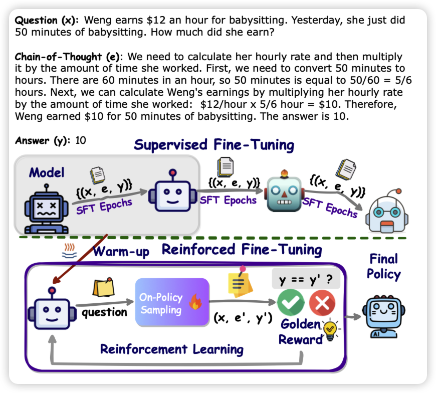

昨天真恐怖……arxiv一天贡献了8个引用

## [REFT: Reasoning with REinforced Fine-Tuning](https://arxiv.org/pdf/2401.08967.pdf)

正常的CoT-finetuning，将(quesiton-CoT-answer)视为一条样本。没有考虑推理链的泛化性，这是因为标注数据实际上只有一条CoT链。

作者思考了一个self-training的框架：如果用题目做没做对的二值反馈作为reward，把这个场景建模成PPO。

> 我总感觉我见过一样的方法，我不确定我是不是记错了……

