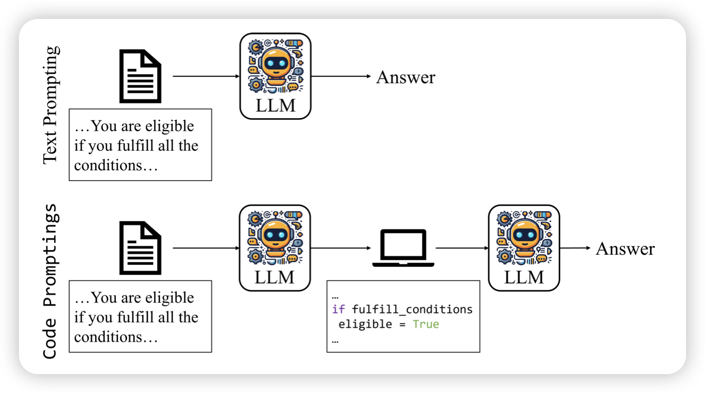

## [Self-Rewarding Language Models](https://arxiv.org/pdf/2401.10020.pdf)

Meta的论文：既然可以做RLAIF，那么这个LLM-as-a-Judge为什么不能是自己？要训练super-human模型，就需要super-human的reward。作者尝试了这种自己同时是rewarder也是generator的训练方式。发现LLama 70B在3 iter以后，就下游任务上就超过了GPT4-0613

> 诶，这个方法没人试过吗？

## [Code Prompting Elicits Conditional Reasoning Abilities in Text+Code LLMs](https://arxiv.org/pdf/2401.10065.pdf)

作者认为，对于代码语言模型来说，没道理prompt就一定得是自然语言。如果表示成代码，是不是更加没有歧义了？作者做了一些实验，把prompt转成代码的形式，发现模型遵循代码的instruction follow能力提升了

## [LoMA: Lossless Compressed Memory Attention](https://arxiv.org/pdf/2401.09486.pdf)

ICML风的论文。作者提到，已有的memory、long-seq研究，大家都希望把前缀表示成更紧凑的形式。然而，这个过程是有损的。作者提出了一个一套无损的压缩方式，并在下游任务中验证了他的有效性。

