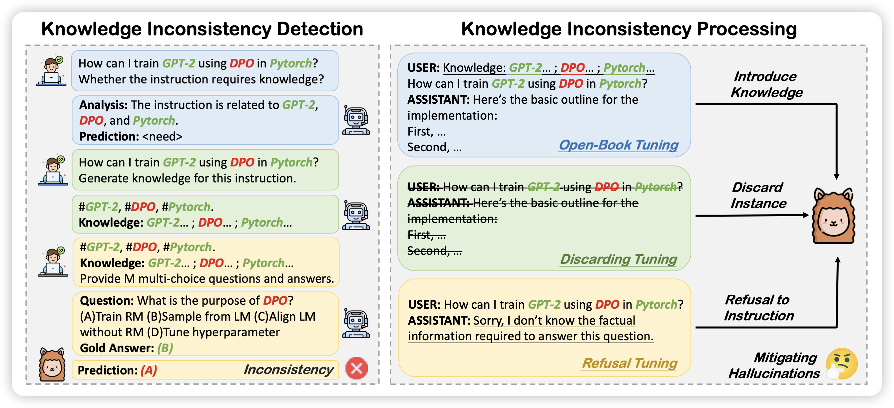
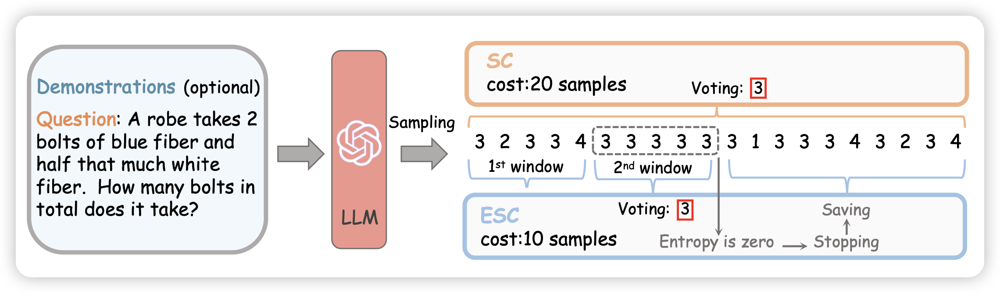
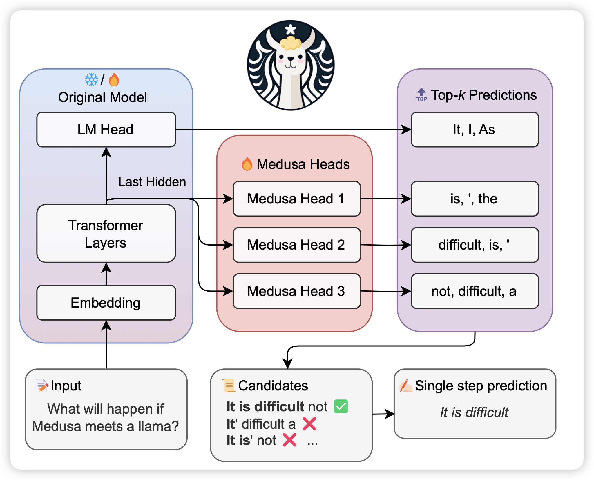

## [Mitigating Hallucinations of Large Language Models via Knowledge Consistent Alignment](https://arxiv.org/pdf/2401.10768.pdf)

这是之前self-knowledge research line，作者发现很多SFT时的hallicinate是因为SFT数据的知识和预训练的知识(或者说模型已学会的知识)冲突。

作者想到了一个专门为模型定制数据的pipeline：

- 先让turbo针对query生成知识点
- 对于每个知识点，让turbo生成自己的理解passage
- 让turbo根据上面的passage提问题
- 根据llama能不能达出来的情况，判断这条SFT数据的知识和固有知识是不是冲突的。进而将SFT数据处理成"sorry message"之类的不同形式

## [Escape Sky-high Cost: Early-stopping Self-Consistency for Multi-step Reasoning](https://arxiv.org/pdf/2401.10480.pdf)

作者认为经典的self-consistency方法(CoT多次，选一个一致性最高的答案)的成本太高，有一个直觉：如果生成了一部分样本，发现已经一致性很高了，是不是就可以early-stopping呢？

作者开发了一套in-batch的self-consistency，如果一个batch内sample的数据已经一致了，就早停。在下游任务上表现不错

## [MEDUSA: Simple LLM Inference Acceleration Framework with Multiple Decoding Heads](https://arxiv.org/pdf/2401.10774.pdf)

解码加速research line，作者认为传统的投机推理需要额外的draft model。作者的想法是能不能让一个模型有多个decoding head做并行，然后用某种方法验证一个最长接受子串，得到比投机推理更快、参数更少的办法

> 我没完全看懂，不过看起来是很有创新的工作

