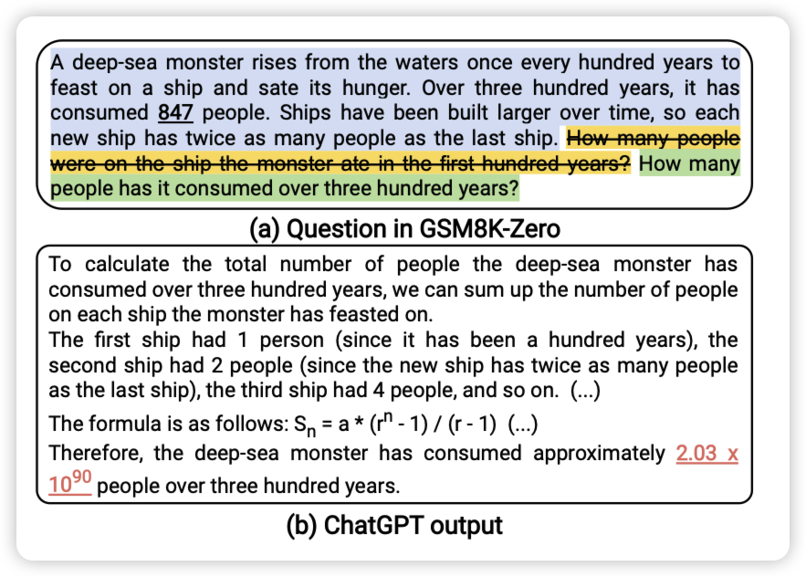
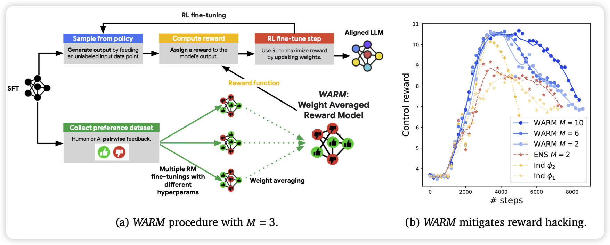
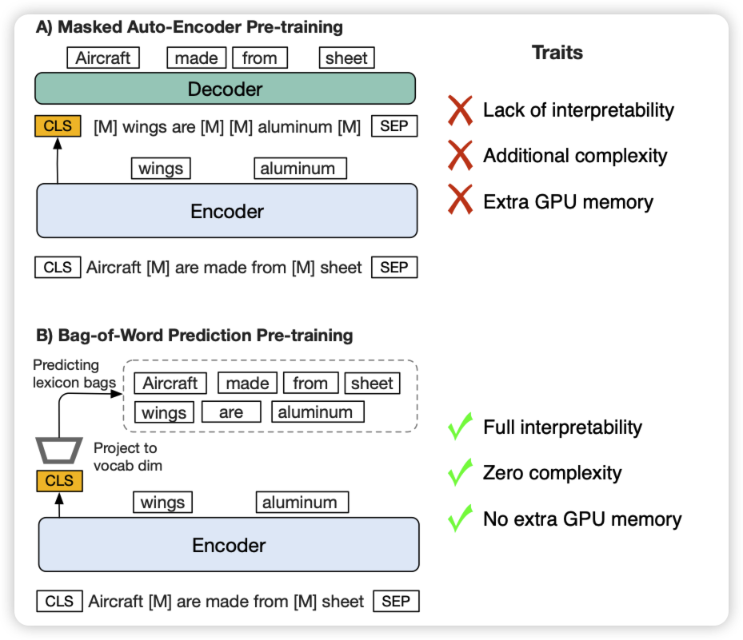

## [Over-Reasoning and Redundant Calculation of Large Language Models](https://arxiv.org/pdf/2401.11467.pdf)

作者发现，在很多任务上，即使很简单，模型还是会生成非常长的CoT浪费计算资源。作者由此改造了一下GSM8K数据集，变成了不需要推理的数据集。发现模型仍然生成很长很冗余的计算，甚至还会做错。

> 嗯，模型是不是背下来了之前的推理链，闭源模型的所谓”zero-shot“要原形毕露了

## [WARM: On the Benefits of Weight Averaged Reward Models](https://arxiv.org/pdf/2401.12187.pdf)

deepmind的论文，作者发现目前的Reward model都是SFT开始训练的，所以实际上几个不同的rm的参数的线性叠加，基本上会反映到score的线性叠加上。所以，如果用不同的超参训几个rm，然后把参数average作为最终的rm，会不会更鲁棒呢？

作者发现，这样训出来的rm确实更鲁棒，由此搞出来的PPO模型效果更好

## [Drop your Decoder: Pre-training with Bag-of-Word Prediction for Dense Passage Retrieval](https://arxiv.org/pdf/2401.11248.pdf)

作者发现传统的Masked Auto-Encoder训练一般是一个encoder和一个decoder，每一部分都是丢失一部分信息。为什么一定要decoder？作者尝试了一个encoder-only的方案，并加入一个额外的cls-loss，直接用cls做预测。发现在retreive任务上，竟然神奇的效果很好

