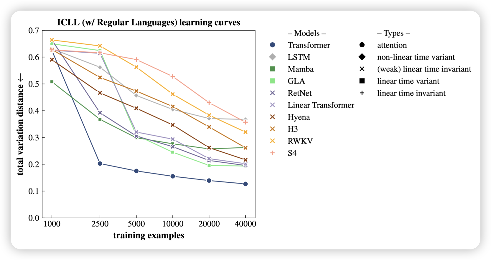

## [In-Context Language Learning: Arhitectures and Algorithms](https://arxiv.org/pdf/2401.12973.pdf)

jacob andreas的论文，作者思考了一个问题：目前的ICL主要瞄准regrssion之类的简单任务，如果对于复杂的ICL，比如finite state automata定义的文法，目前的模型还能做，作者把这个任务叫做In-Context Language Learning。并且发现目前的模型结构只有transformer效果较好

神奇的是，当作者把剩下结构里一些对于ICLL很重要的head硬编码添加回路以后，这些新模型在LLM任务中的表现竟然提升也很明显。

