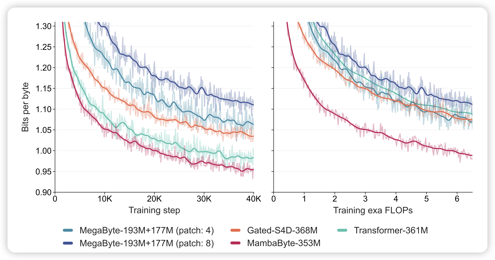

## [MambaByte: Token-free Selective State Space Model](https://arxiv.org/pdf/2401.13660.pdf)

Cornell的论文，作者发现mamba架构对于byte modeling建模能力很好。这个是指不用tokenizer，直接对于char进行建模：总体sequence长，词表小。正好mamba对于长文本的建模复杂度是nlogn

