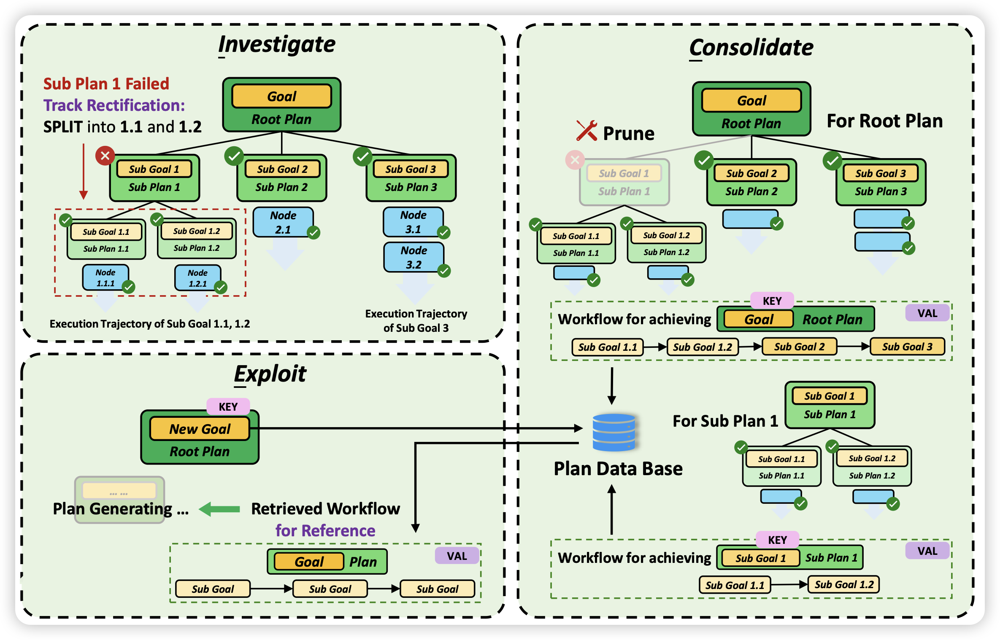
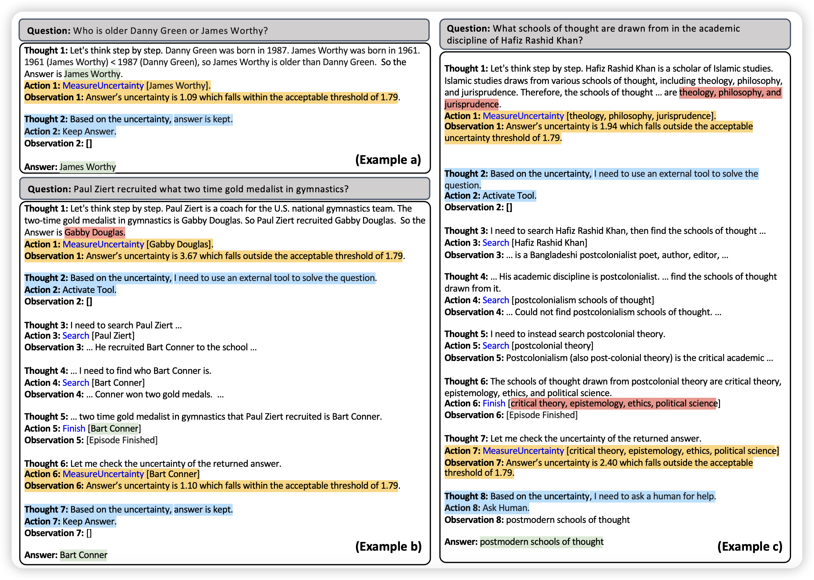
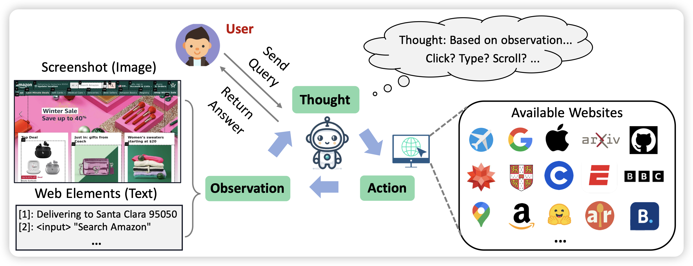
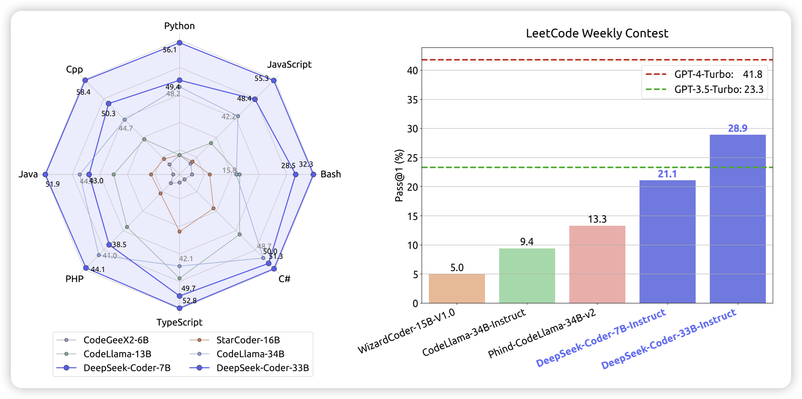

## [Investigate-Consolidate-Exploit: A General Strategy for Inter-Task Agent Self-Evolution]()

推荐一下我们的论文，不算今天的名额：在Agent领域大家一般都是考虑完成一个任务，即使类Reflection的方案也是一个任务失败以后，能不能再次完成做的更好。实际上，没有人考虑任务间的经验学习。我们认为一个好的Agent系统应该具有两个性质：

- 从之前成功的任务中汲取经验
- 从之前失败的任务中获取教训

我们从XAgent出发设计了一套内外层使用不同形式进行self-evolve的框架ICE，并发现他的几个优势：

- 有了之前的经验教训，3.5可以达到之前GPT4的效果
- 对于有信心的地方可以直接按照pipeline的形式走，由此可以节省接近85%的token消耗

由此可见，inter-task evolving的重要意义！

## [Towards Uncertainty-Aware Language Agent](https://arxiv.org/pdf/2401.14016.pdf)

ICML风的论文，作者提到目前的Agent研究主要是走ReACT路线，通过多步工具调用完成任务。然而，没有Agent研究去表征模型自己的不确定性。作者考虑了模型自己在工具调用中的信心值，最终可以用更少的工具调用完成任务，同时提升效果。

> 感觉这个和self-knowledge有异曲同工之意，尤其是作者完成的"Agent"任务实际上也是以QA为主。

## [WebVoyager : Building an End-to-End Web Agent with Large Multimodal Models](https://arxiv.org/pdf/2401.13919.pdf)

相信大家都知道Nvidia之前搞的voyager，那么web-voyager是怎会回事呢？大概就是MM-Navigator、APPAgent那套GPT-4V based Multimodal ReACT路线加上各种observation-clean的工程优化。

> 以后有机会我帮大家梳理分享一下Multimodal Agent都做了什么，和Language Agent的发展是不是有一些对偶的成分在？

## [DeepSeek-Coder: When the Large Language Model Meets Programming - The Rise of Code Intelligence](https://arxiv.org/pdf/2401.14196.pdf)

最新的Code模型，pretrain了2T token，在各个任务上都表现很好，开源。另外，我觉得在leetcode weekly上做评测是一个很好的形式，这样相对来说就不会被大家喷各种Data leakage之类的问题了……

