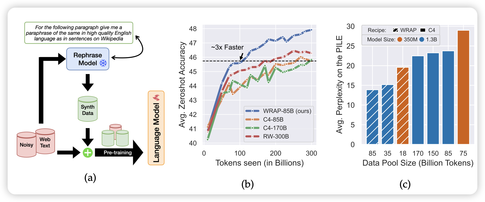
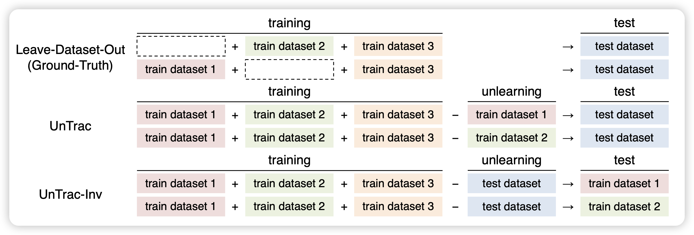

## [Rephrasing the Web: A Recipe for Compute and Data-Efficient Language Modeling](https://arxiv.org/pdf/2401.16380.pdf)

CMU和google的研究，作者思考了一个简单的问题：现在的pretrain-corpus比如C4，虽然数据多但是数据质量太多，我如果用一个别的什么模型比如Llama把C4按照合理、流畅的格式整个重写一遍，会发生什么？

作者把300Btoken重写了一遍，在350M和1.3B规模下尝试了pretrain。发现在原C4和synthetic data联合下训练和把pretrain提速大概3倍，然后在同等训练量下，在C4上的perplexity绝对值可以提升大概10%。换句话说，同样训练token数，350M模型能力比1.3B模型还要好。

## [Unlearning Reveals the Influential Training Data of Language Models](https://arxiv.org/pdf/2401.15241.pdf)

为了训练safety model，很有必要去检测哪些训练数据对模型的表现最关键。最简单的方法是：去掉某些数据，观察效果

然而，这种方法需要训练很多次模型，太贵了。作者想到了一个reverse的方式，如果用一个训好的模型出发，选择一部分数据做梯度上升，再检测，是不是就可以了呢？

作者发现这样反向检测的效果实际上很好，而且对算力的消耗非常小

