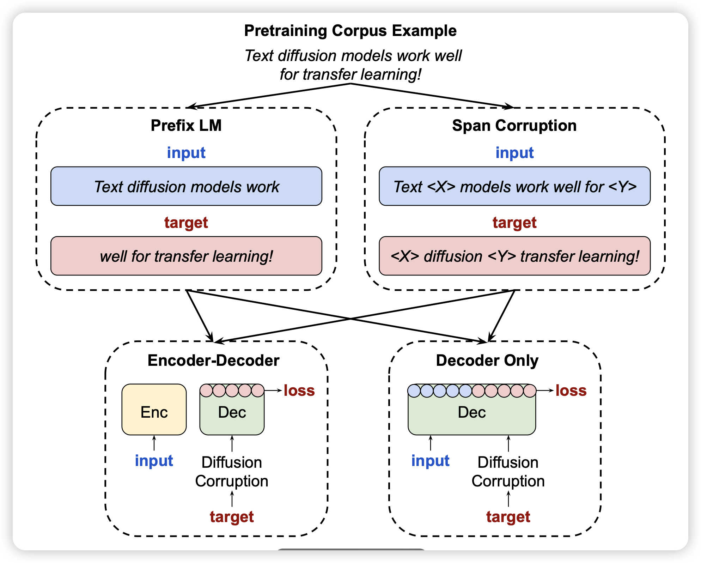

## [Transfer Learning for Text Diffusion Models](https://arxiv.org/pdf/2401.17181.pdf)

deepmind的论文，没想到2024年还有人在搞这个……作者发现了text Diffusion的一个重要问题：training from scratch很困难，不过可以从一个auto-regressive model转换过来，然后接着训练。发现通过这种方式，在一些场景中比如代码，Diffusion model的效果好于传统auto-regressive生成的方式

