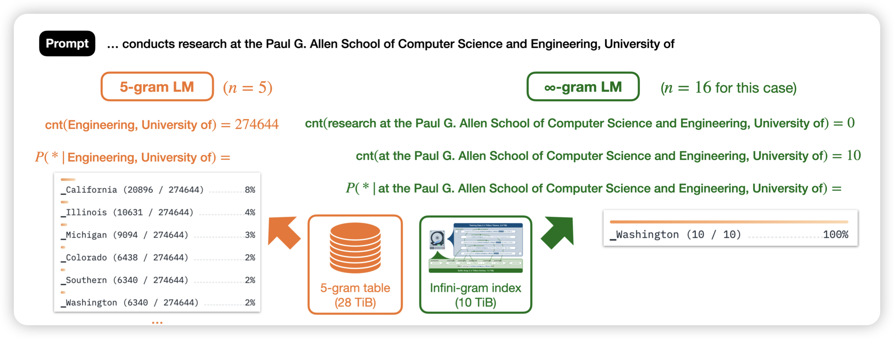
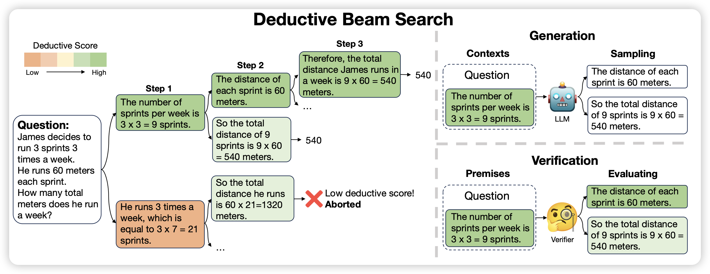
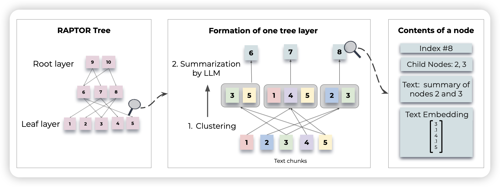

## [Infini-gram: Scaling Unbounded** n-gram Language Models to a Trillion Tokens](https://arxiv.org/pdf/2401.17377.pdf)

> Are *n*-gram language models still relevant in this era of neural large lan- guage models (LLMs)? Our answer is *yes*

Yejin Choi的新活：在1.6TB token的量级上重新尝试了n-gram model，用一个新的算法把n-gram table的复杂度降到很低。作者发现实际上infty-gram model对human text的分类能力极强。并且可以比价好的区分出来人写的、model generated text

## [Deductive Beam Search: Decoding Deducible Rationale for Chain-of-Thought Reasoning](https://arxiv.org/pdf/2401.17686.pdf)

大家都知道beam-search，这篇工作探索了CoT场景下能不能在step粒度做beam-search，作者发现这种方案可以显著缓解模型在CoT过程中的误差累积，进而提升效果

## [RAPTOR: Recursive Abstractive Processing for Tree-Organized Retrieval](https://arxiv.org/pdf/2401.18059.pdf)

作者提到目前的RAG一般是大规模文档按照chunk编码成不同embedding，然后检索接近的chunk。能不能把文档天生组织成树的形式逐步编码呢？

作者开发了一套基于树结构的RAG编码、解码框架，发现效果很好

