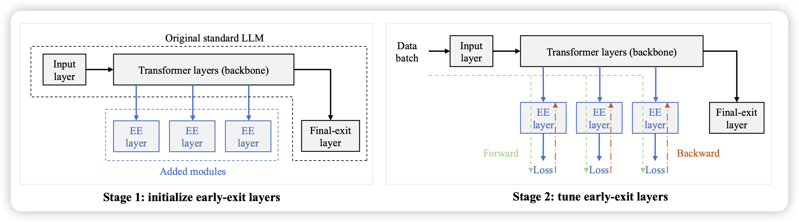
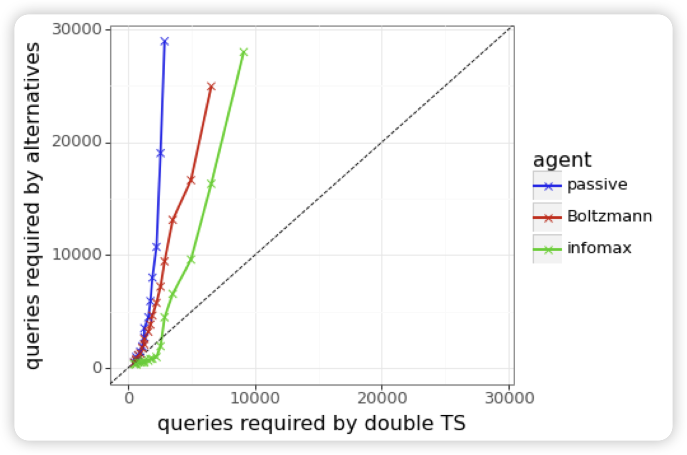
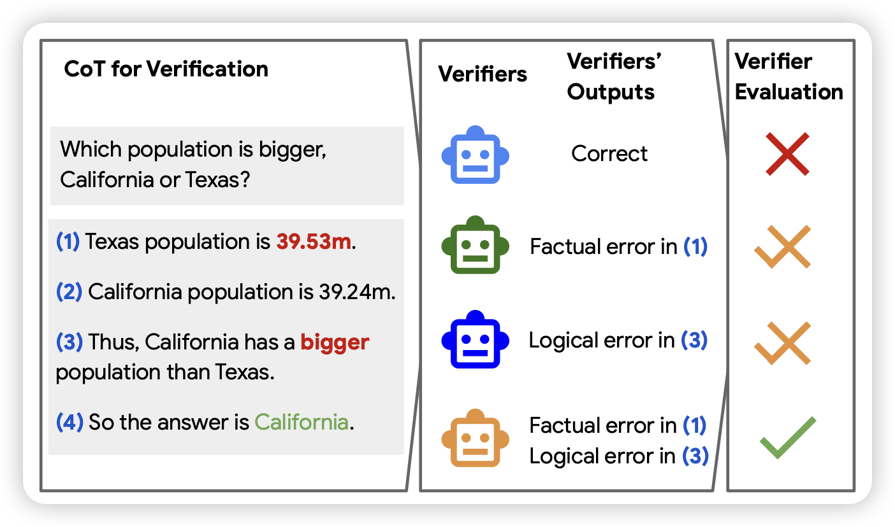
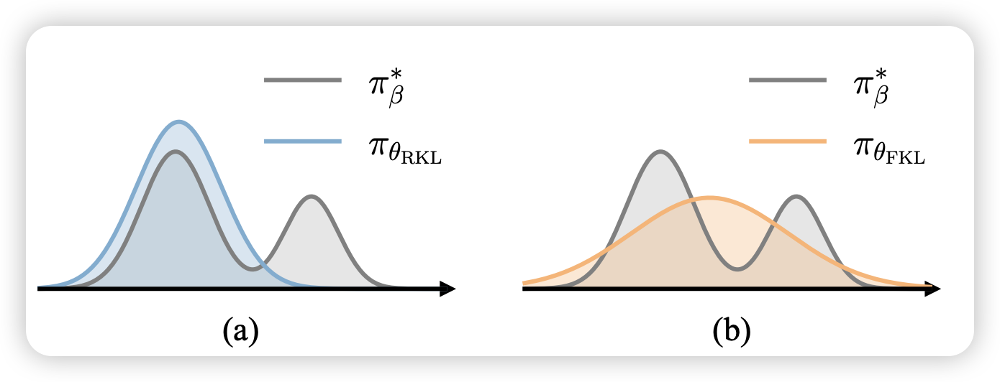

今天全是重量级，那就多分享几篇吧

## [EE-Tuning: An Economical yet Scalable Solution for Tuning Early-Exit Large Language Models]()

这是一个一直有的研究领域：early-exit，思考能不能让模型在推理时对于一些信心值很高的地方提前退出，来动态、主动地平衡效果和需要的计算量。作者提了一套框架，可以从任何一个预训练好的模型上启动early-exit的训练

## [Efficient Exploration for LLMs](https://arxiv.org/pdf/2402.00396.pdf)

deepmind的论文。作者探索了一个问题，目前的RLHF只考虑在一个query集合上优化，模型生成一堆response然后训练：如果允许模型使用一些特殊的、主动的sample算法（而不是开个temperature直接sample）会怎么样？

作者发现，这样的"active"的训练，可以极快地加速模型的收敛

## [A Chain-of-Thought Is as Strong as Its Weakest Link: A Benchmark for Verifiers of Reasoning Chains](https://arxiv.org/pdf/2402.00742.pdf)

这是一篇google的benchmark论文，作者发现：目前有很多研究去自动纠正CoT中的step-error，然后提升效果。但具体这些verifier并没有一个公平的评测，作者给出了一个benchmark，希望可以促进这方面的相关研究。

## [Towards Efficient and Exact Optimization of Language Model Alignment](https://arxiv.org/pdf/2402.00856.pdf)

推荐一下lu cheng学长的论文，有一种ICML风的数学的美。作者提到目前RLHF领域用的比较多的PPO训练不稳定，后面用的多的DPO虽然公式简单训练稳定，但是他的理论基础不够强。

作者由此提出了一套EXO算法， 在理论和实验上都比DPO效果更好。

