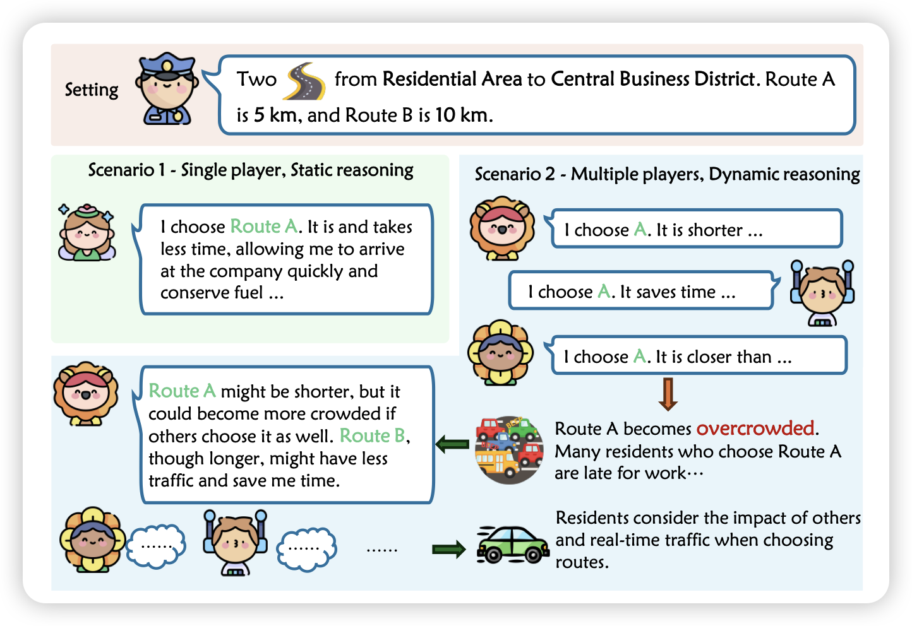
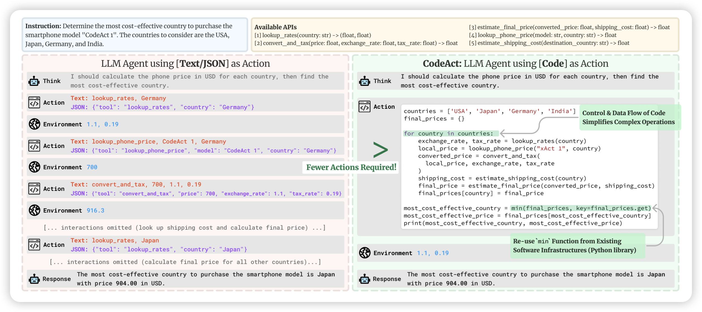

## [K-Level Reasoning with Large Language Models](https://arxiv.org/pdf/2402.01521.pdf)

Furu Wei的论文，作者提到一个事情：目前的Agent大约只考虑了最近的决策，没有考虑到大家的决策对环境的影响。其实在博弈学里面有个递归定义的k-level thinking的概念：考虑了所有(k-1)-level的博弈者情况下的决策，0-level指随机决策。

所以，已有Agent工作大多focus在1-level thinking，作者探索了k-level thinking是否在LLM上可能。发现在模拟任务上效果不错

> 主要是这玩意儿确实不好在真实场景评测，是吧……

## [Executable Code Actions Elicit Better LLM Agents](https://arxiv.org/pdf/2402.01030.pdf)

Heng Ji老师的工作，将ReACT推广到了python中。因为目前的Tool-Agent都是需要用json-schema从pre-defined tools中进行多步调用。如果我们给模型code-intepreter，可以让模型自己写代码去做多步工具调用，自己决定是不是需要添加逻辑，会更好吗？

作者对比了CodeAct和ReAct，发现效果好很多。然后，按照toolBench的形式造SFT数据集、训SFT模型

> 目前的XAgent等工作其实都是支持了code-intepreter，不过确实值得专门把这些形式拿出来对比一下

