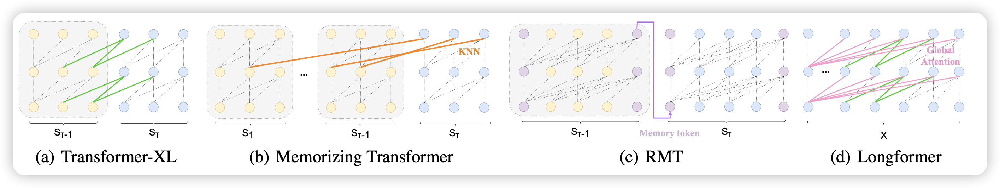
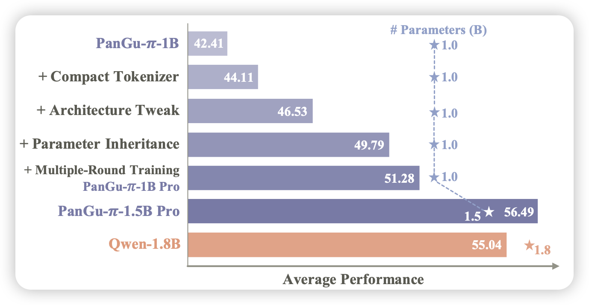

221篇论文，只能说顶级……年前大放送了吗

## [UniMem: Towards a Unified View of Long-Context Large Language Models](https://arxiv.org/pdf/2402.03009.pdf)

首先推荐一下我们组的工作：我们发现目前已有的一些长文本领域的工作主要聚焦于memory的存、取、用方法的不同，实际上可以用一种统一的视角去看待他们。我们设计了一种更通用的方法，可以导出已有的这些不同的长文本模型方法，并且公平对比了他们的效果。

## [Are Large Language Models Good Prompt Optimizers?](https://arxiv.org/pdf/2402.02101.pdf)

目前有一个automatic prompt engineering类型的工作，以google的PRO为代表：想让模型通过看正确、错误样例去调整prompt。

作者重新思考是实验了这类方法，发现：

1. 模型实际上给出的reflection之和自己的先验知识有关，没怎么看in-context错误样本
2. 即使reflection对了，也不能把prompt改对

> 给ape泼了盆冷水呀……

## [Rethinking Optimization and Architecture for Tiny Language Models](https://arxiv.org/pdf/2402.02791.pdf)

huawei的工作，作者探索1B规模的小模型的一系列设计因素，最终得出了最好地训练方式，训练出了效果较为不错的1.5B模型

