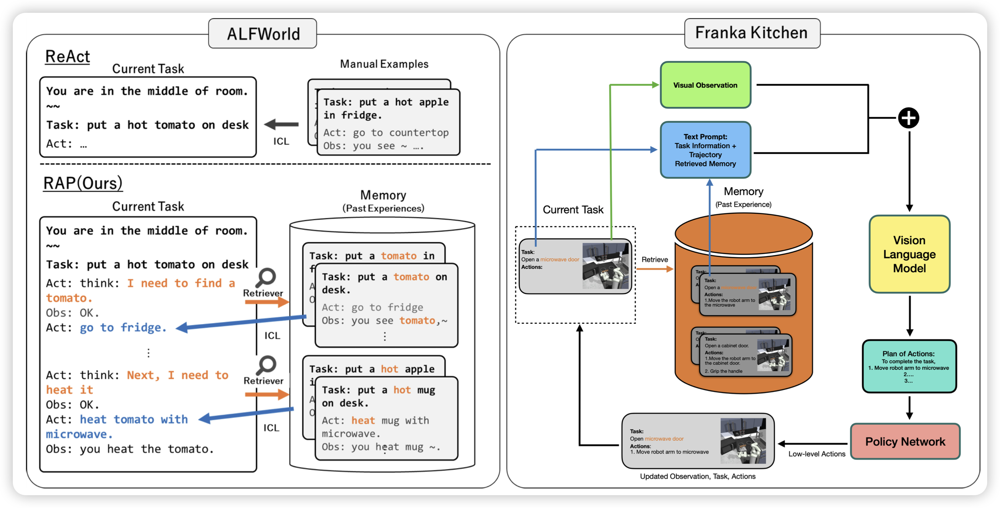
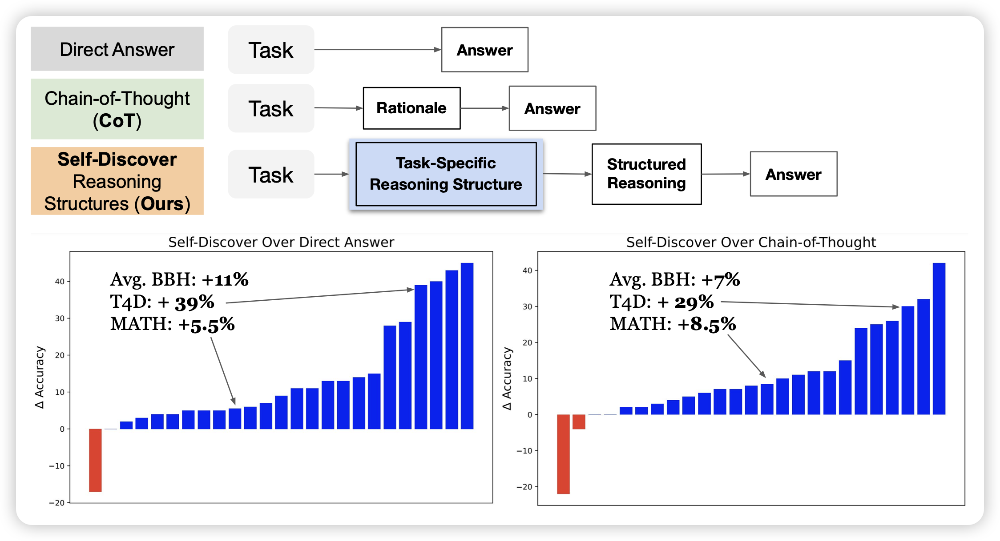

## [RAP: Retrieval-Augmented Planning with Contextual Memory for Multimodal LLM Agents](https://arxiv.org/pdf/2402.03610.pdf)

这个rap不是之前CoT+mcts那个RAP，这个讲的是如何结合MLLM Agent + RAG，或者说voyager里面用的那个"skill set"。作者发现这种简单的改进可以把ALFWorld等任务的效果提升很多

## [SELF-DISCOVER: Large Language Models Self-Compose Reasoning Structures](https://arxiv.org/pdf/2402.03620.pdf)

google的新工作：如果让模型首先根据问题在几种推理模式中(CoT、direct answer等)选择，然后根据选择的模式进行推理，会发生什么？作者发现这种方法比CoT的效果要好40%

> 什么，竟然是，in-context orca2！！
>
> 顺便还要宣传一波t4d数据集是吧……不过这个我确实觉得也挺好的，除了没人引用……

## [Scaling Laws for Downstream Task Performance of Large Language Models](https://arxiv.org/pdf/2402.04177.pdf)

stanford的论文：目前的研究探索了pretrain中的scaling-law。然而，finetune阶段是否也存在scaling-law呢？具体来说，pretrain资源指数增长，finetune以后得效果是不是也可以线性增长呢？

作者在翻译任务中基本证实了这个观点

