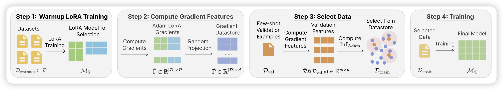

昨天坐车没来得及更新，今天把两天的一起补上。今天的论文不多，不过内容还都挺有意思的

## [LESS: Selecting Influential Data for Targeted Instruction Tuning](https://arxiv.org/pdf/2402.04333.pdf)

danqi chen的论文。作者提到如果instruction的目的是学到一些特定的能力，比如reasoning，其实不是所有数据都对最终结果有效果，这个场景可以认为是Targeted Instruction Tuning。作者提出了一套optimizer-aware的算法，根据gradient自动去选择最有效的数据。作者发现用该方法，选择5%的数据其最终效果要优于全数据SFT。另外，选择的数据具有稳定性、一致性：在同样的目的中，小模型选择的数据和大模型选择的数据是一致的。

