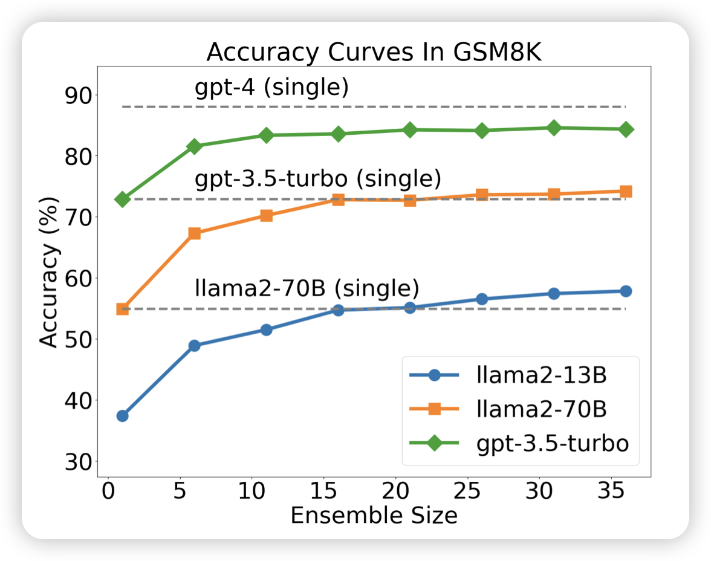

让我们看看除夕有什么好宝贝！

## [More Agents Is All You Need](https://arxiv.org/pdf/2402.05120.pdf)

腾讯的论文，起名仙人来了……作者大致是重新发现了self-consistency，并发现效果很好

> 还真是，大家好像没人试过self-consistency中如果这些样本是由多个模型sample出来的，或者不同的sample算法得出来的，会怎么样

## [WEBLINX: Real-World Website Navigation with Multi-Turn Dialogue](https://arxiv.org/pdf/2402.05930.pdf)

是一个MLLM Agent的工作，作者发现：目前的GUI Agent实际上并没有能力去end2end解决用户的任务，所以做了一个multi-turn dialogue的100k数据集，Agent除了进行GUI操作，还可以在必要的时候向用户提问。最终通过HCI的方式完成任务

