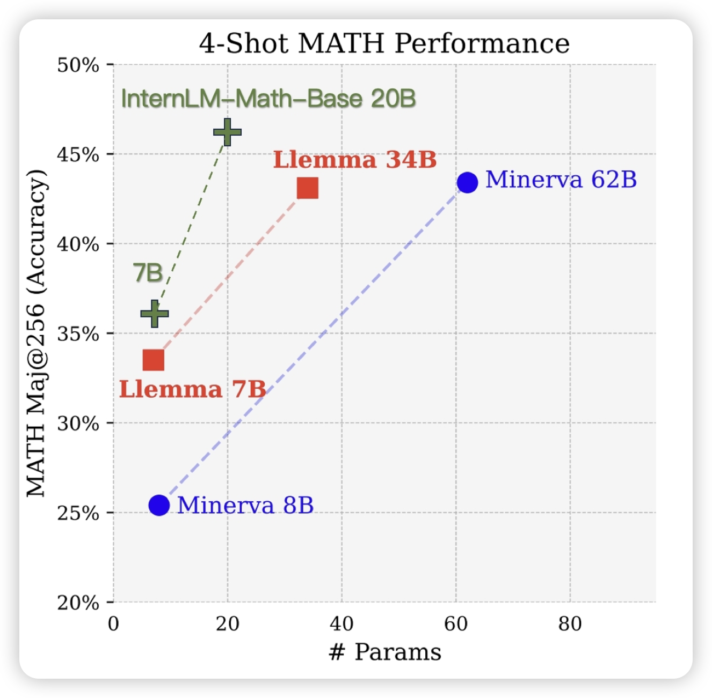
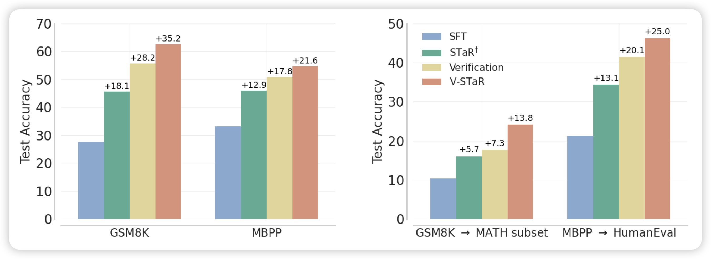

## [InternLM-Math: Open Math Large Language Models Toward Verifiable Reasoning](https://arxiv.org/pdf/2402.06332.pdf)

最新出的数学模型，优势在于他把solving、proof、verifier、rewarding等任务统一成了seq2seq形式，所以这个模型训练完了以后天然可以做各种math的数学任务

## [V-STaR: Training Verifiers for Self-Taught Reasoners](https://arxiv.org/pdf/2402.06457.pdf)

大家都知道STaR：生成一堆样本，然后把答案正确的样本作为正样本去SFT。STaR没有考虑答案错误的负样本

微软和deepmind的新工作考虑了负样本，用一个verifier评判答案的好坏，进而使用DPO算法去优化模型，在下游任务上得到了比STaR更好的效果。简单来说

> 之前的ReFT论文用了PPO，没有用verifier。之前deepmind那篇PRM，用了verifier，但没有用DPO(用的self-train)
>
> 所以这个算增量吗？好像也不完全算……

