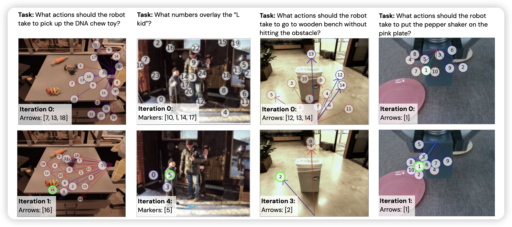
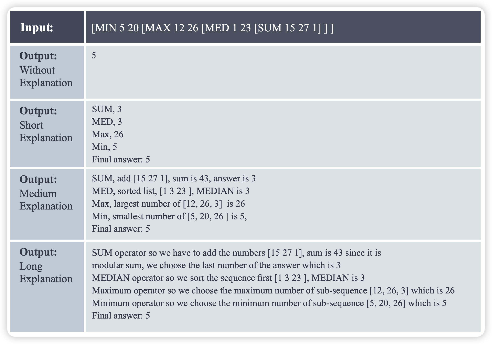
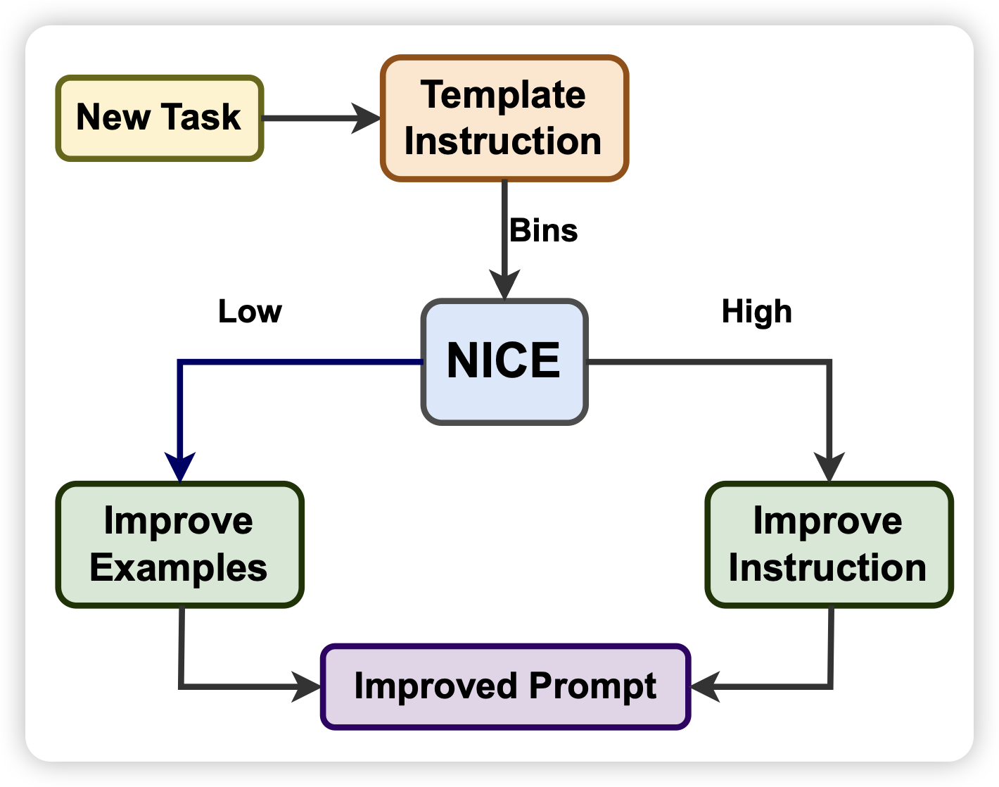

93篇，估计是这周的小高峰了，佳作频出呀

## [PIVOT: Iterative Visual Prompting Elicits Actionable Knowledge for VLMs](https://arxiv.org/pdf/2402.07872.pdf)

Google新作，作者提到在robotic等领域如何将physical-action对齐到VLM操作上？作者采用一个简单的办法:

1. 将action数据选择一个视角，渲染成图片
2. 随机生成一堆负样本和正样本
3. 然后对于VLM变成一个选择题，优化VLM的概率分布

作者发现，这个算法虽然简单，但效果其实非常好，而且非常scalable

## [Show Me How It’s Done: The Role of Explanations in Fine-Tuning Language Models](https://arxiv.org/pdf/2402.07543.pdf)

作者在T5上尝试把finetune数据改成这种带有解释的形式。发现比起原始数据的finetune，小模型可以更好的学会下游任务，并且可以让模型做出来原始finetune根本学不会的任务

## [NICE: To Optimize In-Context Examples or Not?](https://arxiv.org/pdf/2402.06733.pdf)

微软的工作：作者提到，目前的In-context研究领域一般focus在如何修改、转换in-context样本的格式，没人考虑过instruction是不是有问题。作者把instruction和in-context样本的转换联合考虑起来，得到了比任何一种单一的修改都更好的效果。

