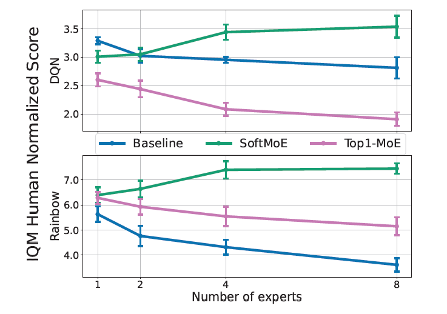

情人节，51个大聪明还在挂论文，1个大聪明还在刷论文……

## [Mixtures of Experts Unlock Parameter Scaling for Deep RL]()

> CG track没活了，还是看看远处的AI track吧

deepmind发现经典的NLP领域有scaling law，大就是好。然而对于RL，似乎不是这样，大规模扩大parameters，模型效果反而会下降。作者做了一系列探索，发现MoE结构，尤其是softmax-MoE结构下，RL也能有scaling-law了。所以，OpenAI的风终于吹到RL了吗……

## [Active Preference Learning for Large Language Models]()

作者讲了一个好玩的思路：目前的RLHF都是被动的，换句话说是按照某种temperate去sample一堆样本按照好坏去做优化。那么，能不能让模型更主动地参与到训练中来呢？作者开发了一套改进的DPO方案，选择样本的方式不是随机的，而是按照score排序进行的。得到了相对更好的结果
