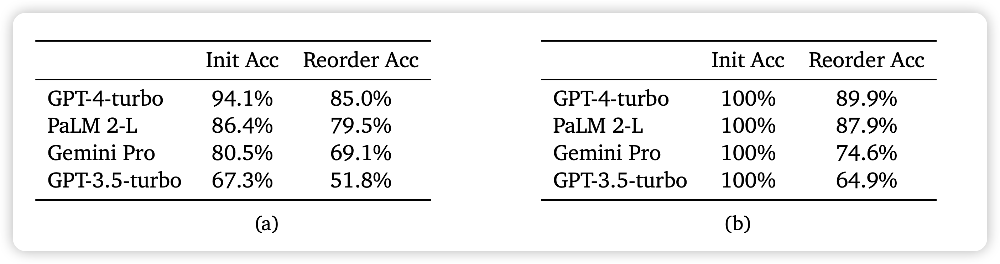
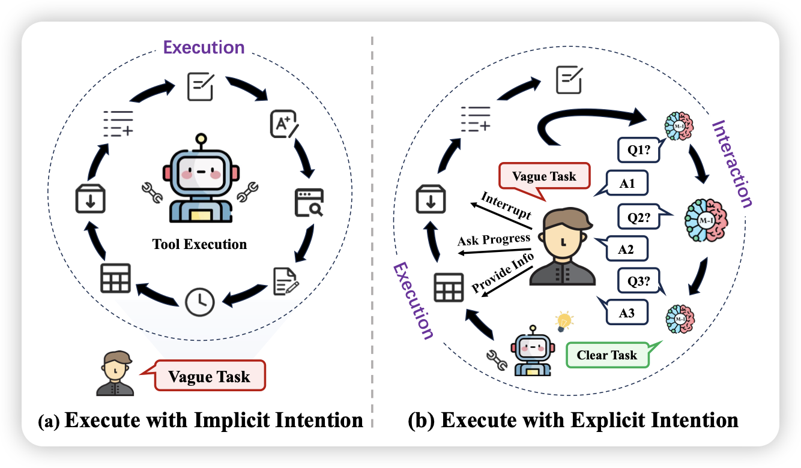

## [Premise Order Matters in Reasoning with Large Language Models](https://arxiv.org/pdf/2402.08939.pdf)

Denny Zhou的论文，作者发现在推理任务中，先决条件的相对位置虽然不影响语义，但是对模型的效果影响非常大。具体来说：

> If A then B. If B then C. A is True, What is C?
>
> If B then C. If A then B. A is True, What is C?

这两个题目是等价的，但模型就回答不出来第二个。从这个思路出发，作者做了一个R-GSM benchmark，把GSM8K题目里面的条件的相对位置改了改，发现模型效果直接崩了……

## [Tell Me More! Towards Implicit User Intention Understanding of Language Model Driven Agents](https://arxiv.org/pdf/2402.09205.pdf)

推荐我们组的工作。我们发现很多情况下，一个任务做不出来，不是Agent能力不够强，而是最开始下达的任务就有问题：问题无解、问题模糊等等。在这种情况下，如何让Agent主动地去让用户表达清楚自己的需求就非常重要了。

我们在XAgent框架下进行了尝试，发现赋予Agent主动和人类交互去表达观点的能力以后，模型的能力有了一个很大地提升

