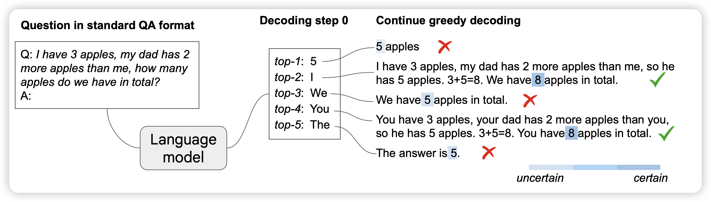
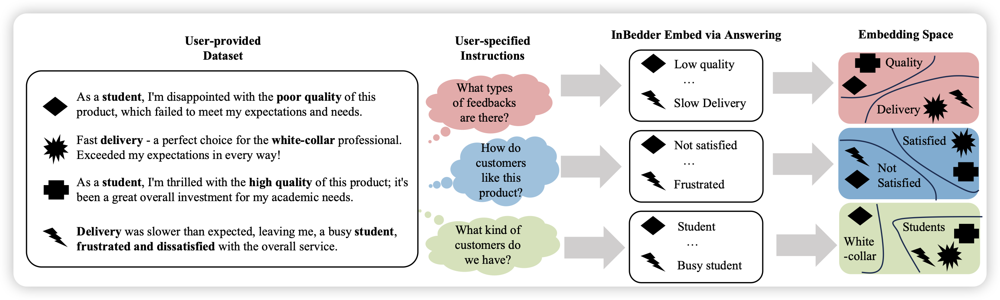

> 今天挂论文真的倒霉……风头全被sora和gemini-1.5抢了……

## [Chain-of-Thought Reasoning Without Prompting](https://arxiv.org/pdf/2402.10200.pdf)

Denny Zhou的论文：作者尝试了在解码时不使用prompt技巧鼓励模型用CoT，而是直接通过解码算法让模型使用CoT。作者发现通过这种方法激发出来了CoT能力其实也很好，而且可以使用不同的reasoning module去完成任务。

## [Answer is All You Need: Instruction-following Text Embedding via Answering the Question](https://arxiv.org/pdf/2402.09642.pdf)

作者对于text embedding建模想到了一个简单的框架：如果找embedding是为了使用，那么不妨直接用QA的形式组织text embedding的表示。并且在instruction-aware的测试中取得了较好的效果

