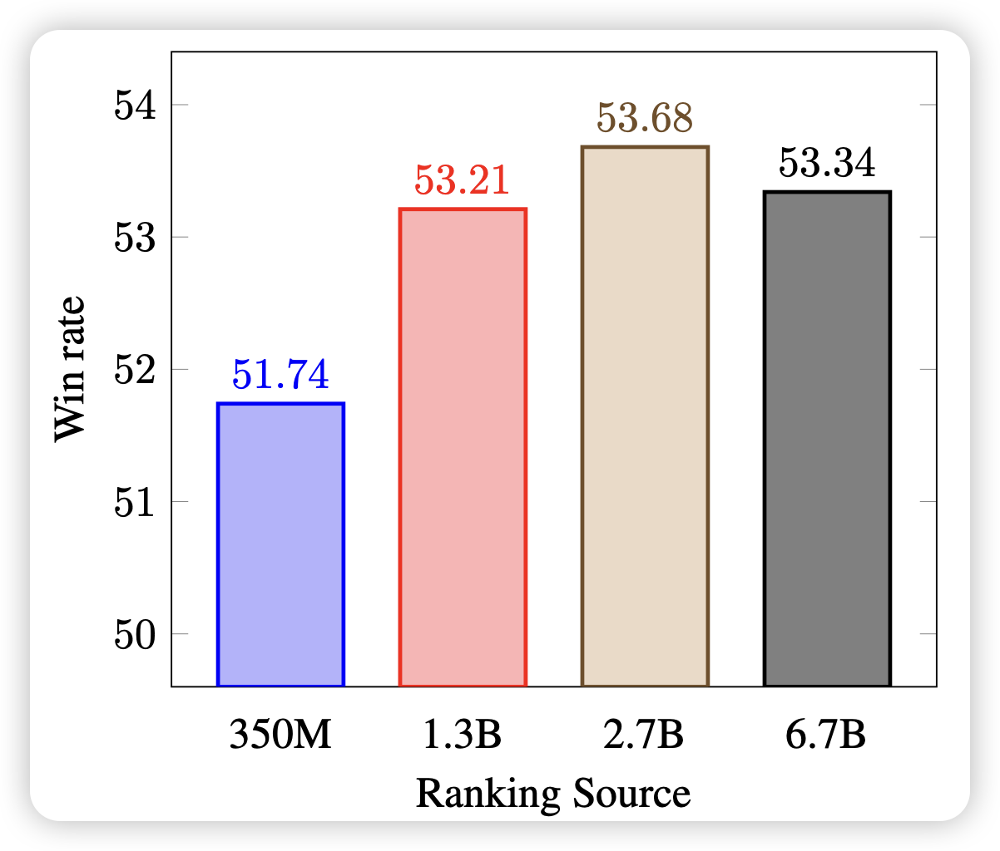
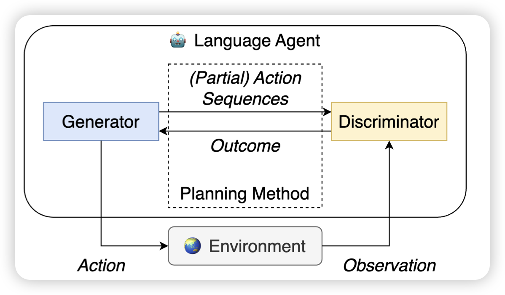

最近一周去旅游了，回来一看竟然欠了680多篇论文？？？别急，慢慢补……

## [Smaller Language Models are capable of selecting Instruction-Tuning Training Data for Larger Language Models](https://arxiv.org/pdf/2402.10430.pdf)

SFT的数据选择对结果的影响很大，引入一些不好的SFT数据，反而会使得模型的效果更差。作者认为，数据的质量是数据的固有属性，并尝试用较小的模型选择SFT数据，并发现：即使用350M模型帮13B模型选择数据，效果仍然很好

## [When is Tree Search Useful for LLM Planning? It Depends on the Discriminator](https://arxiv.org/pdf/2402.10890.pdf)

作者探索了Agent里面的Tree-search和reflection两种方法，发现：只有当外界的反馈准确率超过90%时，Tree-search的能力才能显现出来，目前的LLM-vote基本上没有达到这个水平。所以，目前的Tree-search类方法可能得不偿失，在需要10倍计算量的基础上，提升并不明显。

