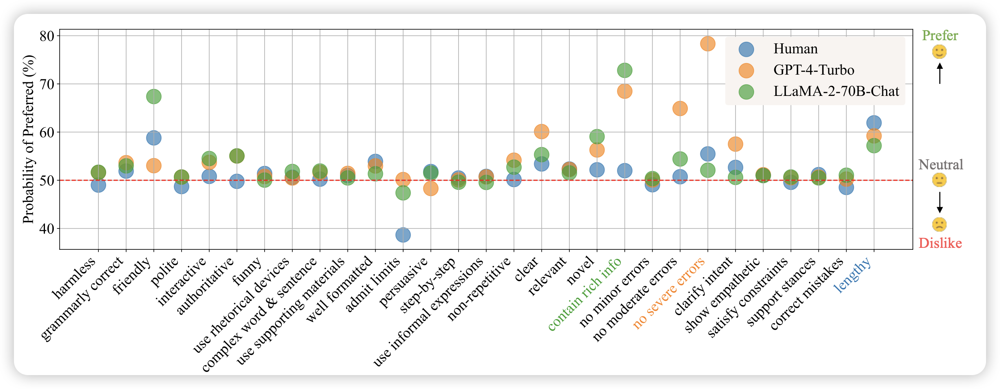
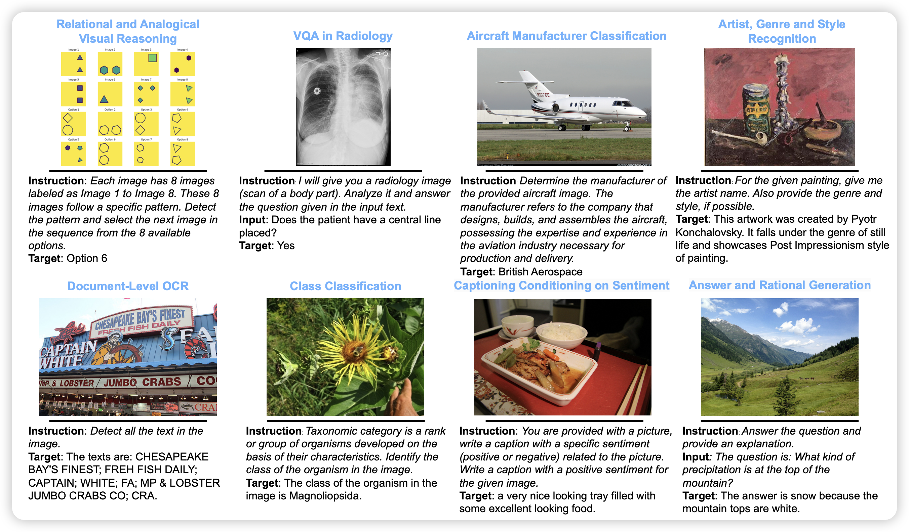
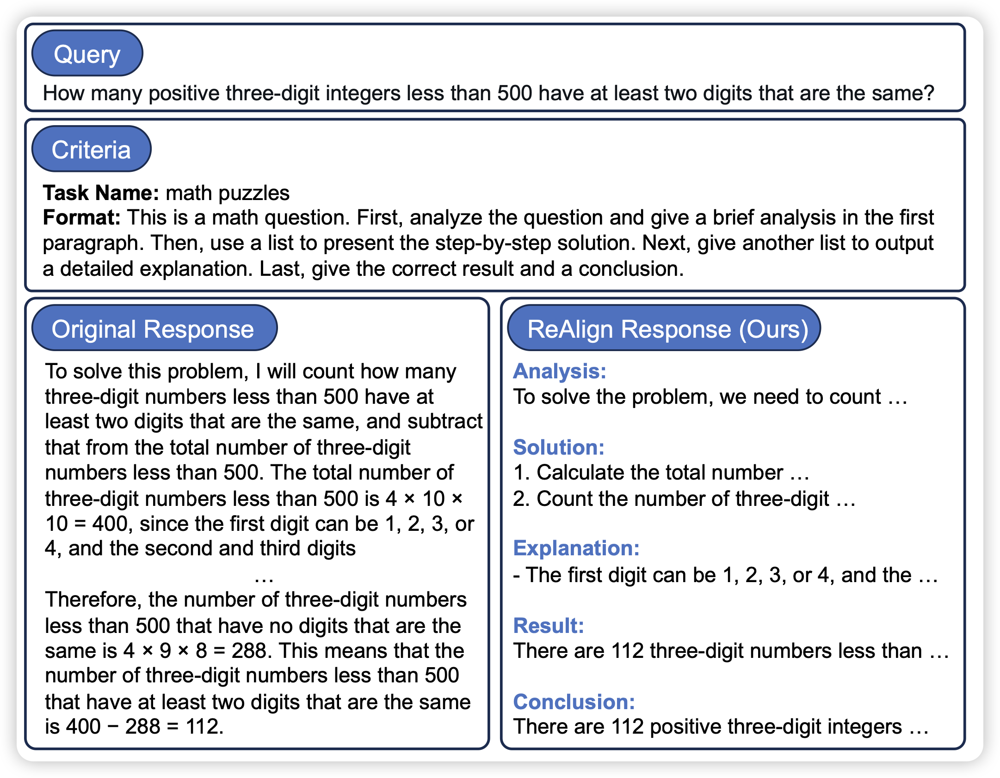

265篇，最恐怖的一集

## [Dissecting Human and LLM Preferences](https://arxiv.org/pdf/2402.11296.pdf)

作者对比了human preference和model vote preference的区别,发现

1. 人类的偏好相对于模型偏好来说：对错误不敏感，偏好支持query陈述的response，当模型承认不会时打低分。
2. 类似大小的模型似乎有相同的偏好倾向，无论训练方式是什么
3. 通过拟合judger的偏好，再仅仅换一换generator system prompt的情况下，实际上就能极大地提高模型的Performance

## [Vision-Flan: Scaling Human-Labeled Tasks in Visual Instruction Tuning](https://arxiv.org/pdf/2402.11690.pdf)

meta的论文，作者发现目前的vision SFT阶段中，GPT-4v的数据不是关键，更diverse的query才是。作者收集了187个任务，大约1.6M的instance，由此进行了SFT，发现效果远胜于之前的模型。并得出了三点结论：

1. GPT-4v的response不能让模型学会通用的visual能力，但是会让response的格式更符合human的预期
2. 格式更符合human预期的问题，只需要1000条GPT-4v的response就能学到
3. 真正的通用visual能力，来源于更diverse的query

## [Reformatted Alignment](https://arxiv.org/pdf/2402.12219.pdf)

作者发现，目前的SFT数据的格式并不完美，如果用一些更好的方式组织response，可以极大地降低模型hallucinate，提升模型效果。具体来说，对于GSM8k，仅仅把response格式换一下，acc就能从55%涨到65%

