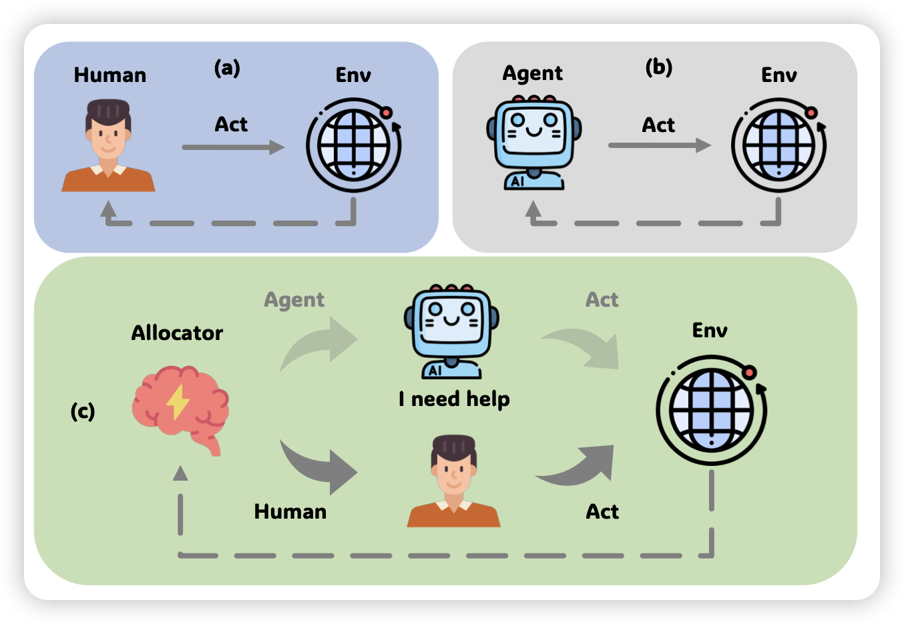
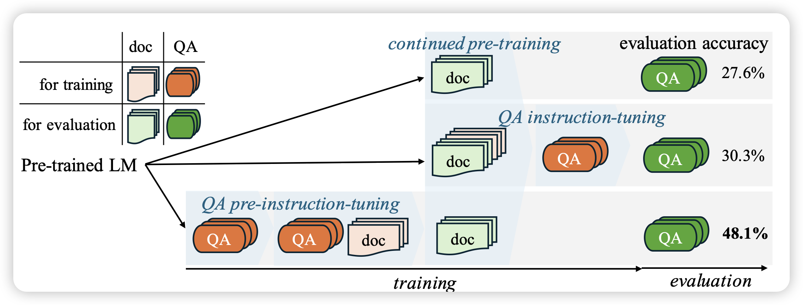
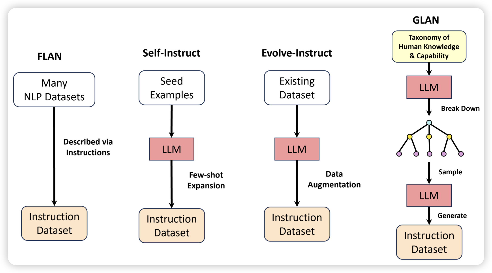

## [Large Language Model-based Human-Agent Collaboration for Complex Task Solving](https://arxiv.org/pdf/2402.12914.pdf)

推荐我们组的工作：在现实场景中Agent往往难以解决复杂的问题，在这种情况更重要的问题是如何让Agent和human进行协同工作。然而，另一个极端就是Agent变得非常lazy一直去找人帮忙。因此，我们需要的是Agent自己决定在最需要的时候联系human。作者设计来一套RL-based框架对这个问题做了初步的探索，并取得了较为不错的结果

## [Instruction-tuned Language Models are Better Knowledge Learners](https://arxiv.org/pdf/2402.12847.pdf)

这篇的逻辑和下面那个GLAN有点像：作者认为下游任务中我们往往希望类QA的chat形式，然而在continue pretrain阶段的数据往往是非QA的格式，这就造成了知识与使用的mismatch。因此，作者尝试了，能不能先学会QA再学知识呢？

作者发现，这种形式的模型可以对continue pretrain阶段的数据有更好的掌握

## [Synthetic Data (Almost) from Scratch: Generalized Instruction Tuning for Language Models](https://arxiv.org/pdf/2402.13064.pdf)

作者认为，人类世界的知识和能力天生是具有层次结构的，如果我们在instruction tuning阶段想要让模型学会follow指令并且补充世界知识，那么能不能用类似课程学习的方法，先把知识进行层次化归纳，再根据刚才归纳的知识来生成对应QA-pair

 
