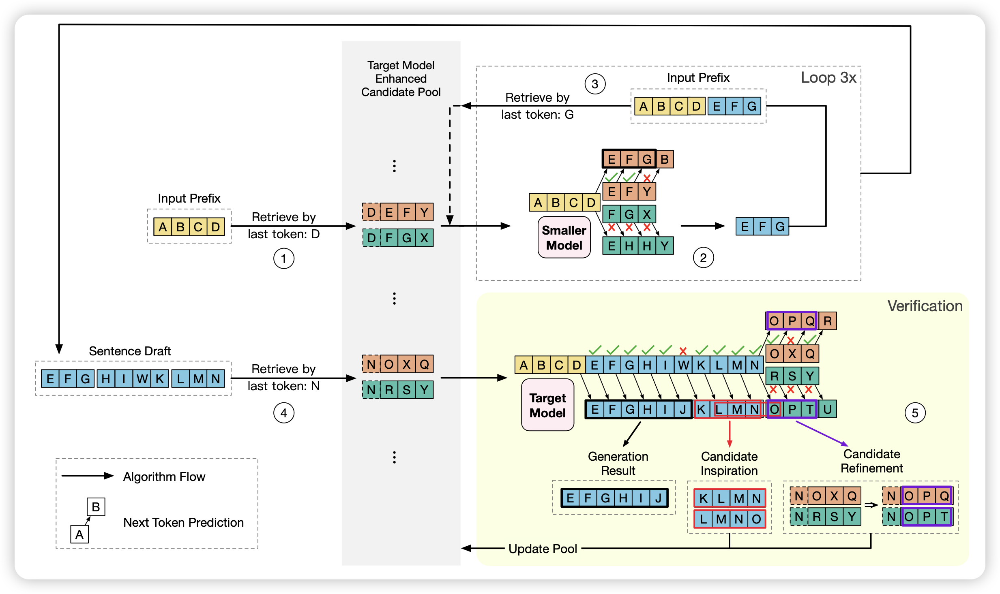
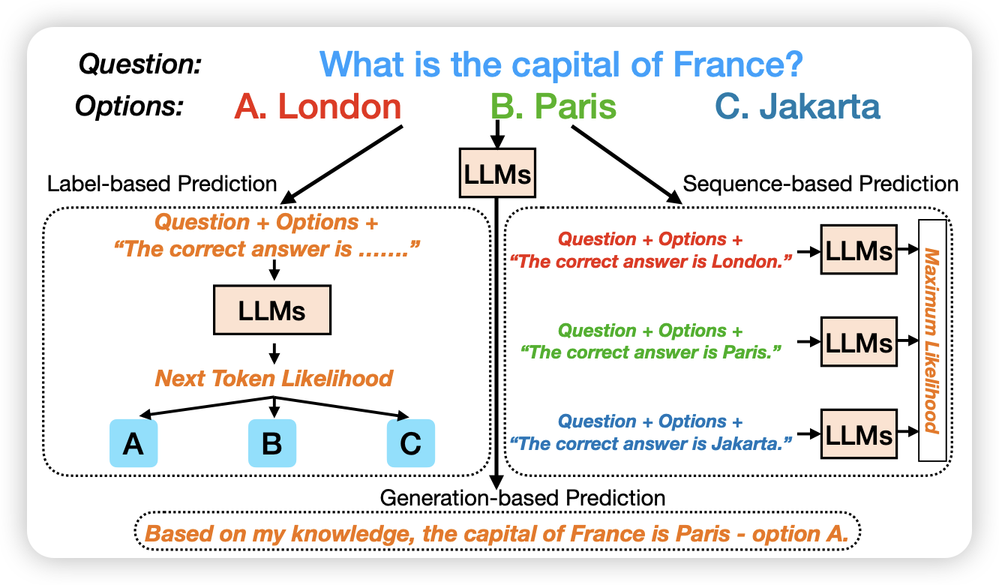

上一周怎么每天都是这么多篇

## [Ouroboros: Speculative Decoding with Large Model Enhanced Drafting](https://arxiv.org/pdf/2402.13720.pdf)

推荐威霖的工作，非常聪明的想法！：作者发现，目前的投机推理需要小模型快速生成，然后让大模型去验证，验证成功的token就会被大模型接受，失败的情况下，前面的token被接受，后面的被放弃。

威霖考虑了后面的情况，虽然被放弃了，但只是因为中间的某一个token不够好，不代表剩下的后缀没有意义。所以，能不能把投机推理看做对一大堆candidate同时进行验证呢？之前失败的后缀仍然可以作为后续的candidate。通过这种方案，在相同的资源消耗量下，可以把投机推理继续加速2倍

> 很久没有这么耳目一新的感觉了

## [Beyond Probabilities: Unveiling the Misalignment in Evaluating Large Language Models](https://arxiv.org/pdf/2402.13887.pdf)

分析性文章，作者发现目前评测LLM能力时大致有几种模式：

1. label-based: 给问题和选项，然后观察next-token是各个选项的概率
2. sequence-based: 给定问题-答案对，观察不同candidate的ppl
3. generation-based: 给定问题和选项，让模型自己生成，最后在string上分析模型选了什么

作者探索一个问题：这几种模式，得到的结果是一样的吗？

