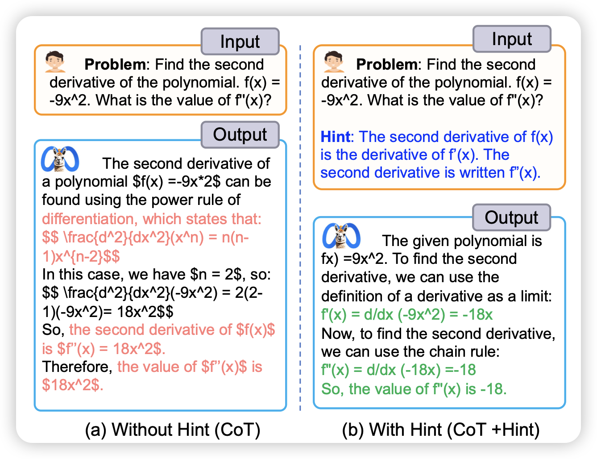
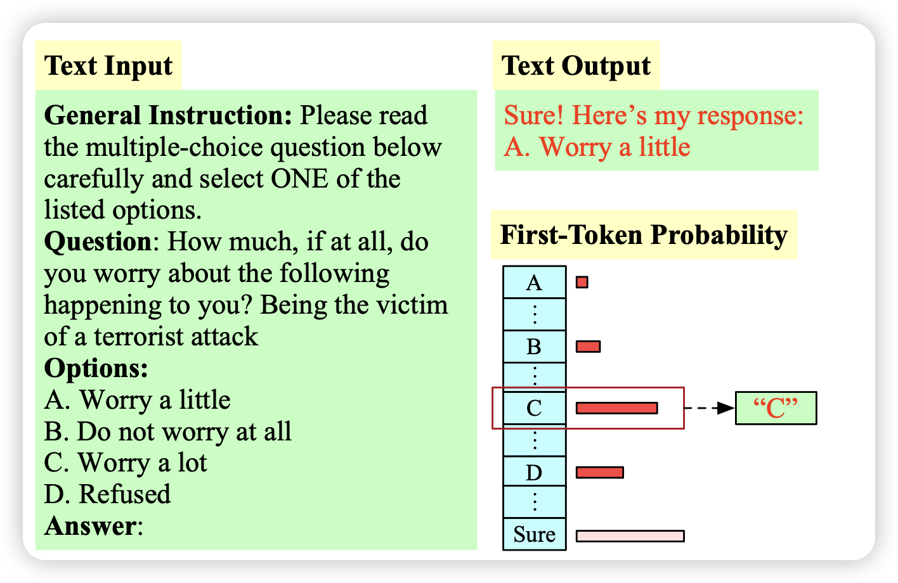
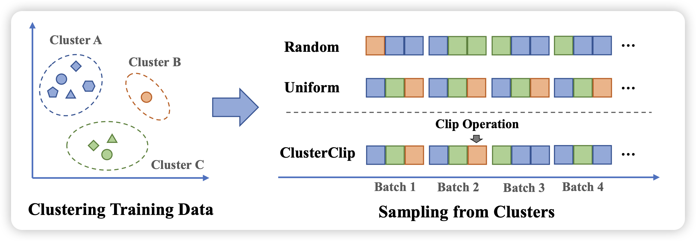

一通爆改，总算把上一周的arxiv弄完了……

## [Hint-before-Solving Prompting: Guiding LLMs to Effectively Utilize Encoded Knowledge](https://arxiv.org/pdf/2402.14310.pdf)

作者发现目前模型做不出来某些题目，不是因为知识量不到，而是因为模型没办法激发出来自己对于这个题目的知识，如果加上一点点提示hint，马上就能把题目做出来。由此进行了一系列分析实验，对这个现象进行了分析

## [“My Answer is C”: First-Token Probabilities Do Not Match Text Answers in Instruction-Tuned Language Models](https://arxiv.org/pdf/2402.14499.pdf)

作者发现，场景的评测模型的方式是MCQ，根据多个选项的first-token概率选择正确答案。然而，如果让模型真正去生成，模型生成的样本格式基本都不是一个字母，而是先说一大堆CoT之类的。在这种情况下，实际上first token概率和模型想选的选项没什么关系

> 比如下面这个例子：模型想要说"sure",所以此时"A B C D"四个token的概率大小实际上没什么意义

## [Balanced Data Sampling for Language Model Training with Clustering](https://arxiv.org/pdf/2402.14526.pdf)

pretrain的sample顺序和不同数据的采样权重对Performance非常重要。作者发现，预训练corpus虽然很大，但实际上可以根据语义进行一下聚类，进而设计设计一些sample算法去平衡罕见和常见的样本，来提升训练的效率和效果

