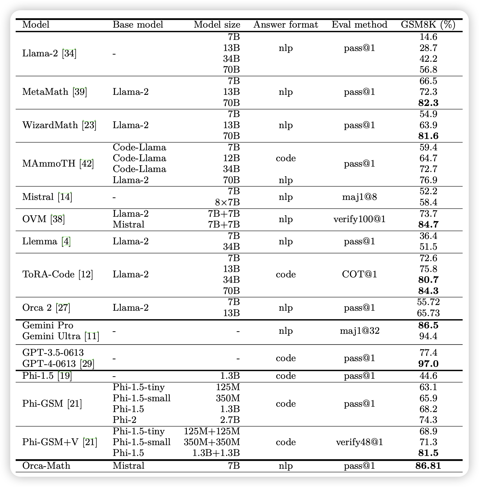
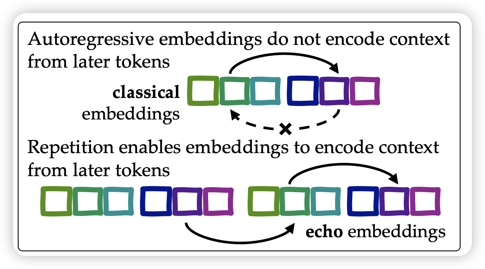

## [Orca-Math: Unlocking the potential of SLMs in Grade School Math](https://arxiv.org/pdf/2402.14830.pdf)

orca团队的新作，作者发现，用Multi-agent framework构造200k数据，加上一个SFT，就能把GSM8K top1 acc打到80%

## [Repetition Improves Language Model Embeddings](https://arxiv.org/pdf/2402.15449.pdf)

作者发现，对于经典的text embedding提取方式，模型似乎并没有办法把后面token的语义考虑进前文。作者想了个简单的办法，把原始语料重复一遍，用后面那份prefix的embedding。

