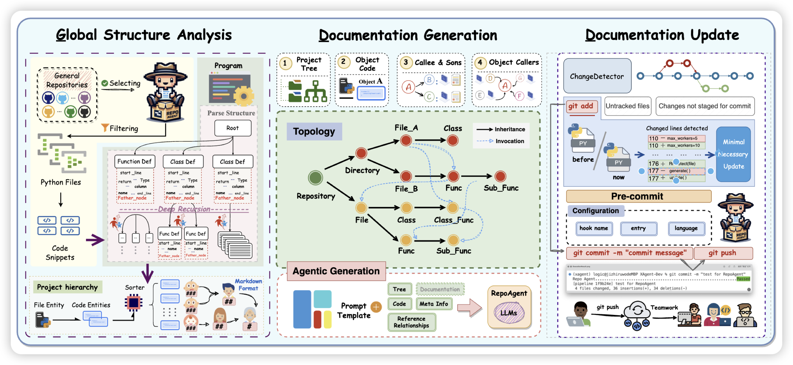
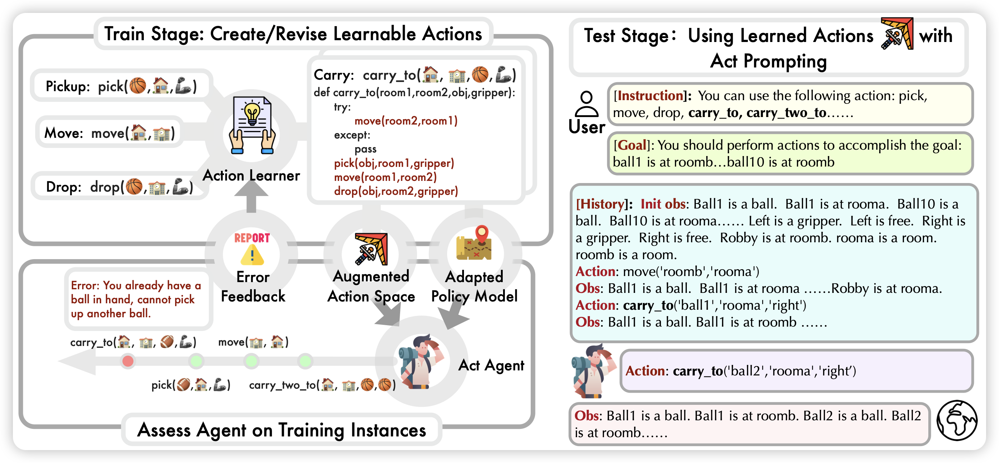

## [RepoAgent: An LLM-Powered Open-Source Framework for Repository-level Code Documentation Generation](https://arxiv.org/pdf/2402.16667.pdf)

推荐一下我参与的小品工作：如何基于LLM Agent来自动帮助仓库生成和维护documentation。我们核心发现在于：

1. 已有工作几乎没有生成repo-level的doc的
2. 使用GPT4、甚至3.5，得到的效果远超之前的工作
3. 生成documentation实际上效果非常好

## [Empowering Large Language Model Agents through Action Learning](https://arxiv.org/pdf/2402.15809.pdf)

作者思考的问题在于，很多场景的action space是固定的， 模型不能从过去的trace里学习、组合新的action。所以作者设计了一套迭代式的action space更新方法，并在ALFWorld场景进行了测试

> 这个思路有点像之前CREATOR的工具创造，以及vogayer里面的skill library

