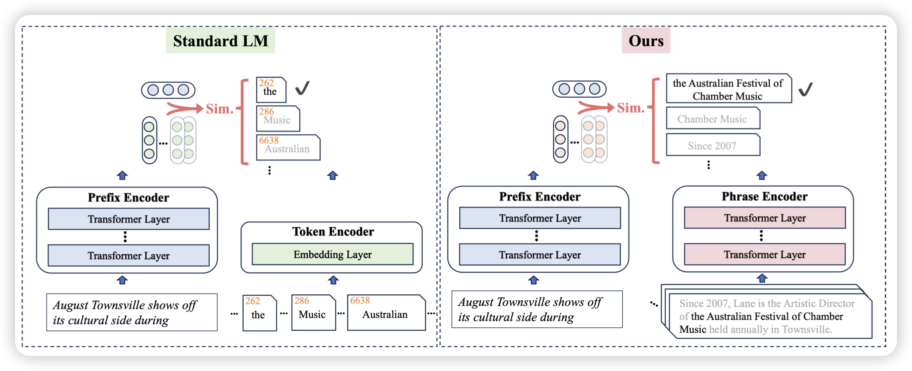
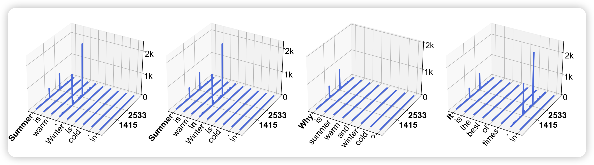
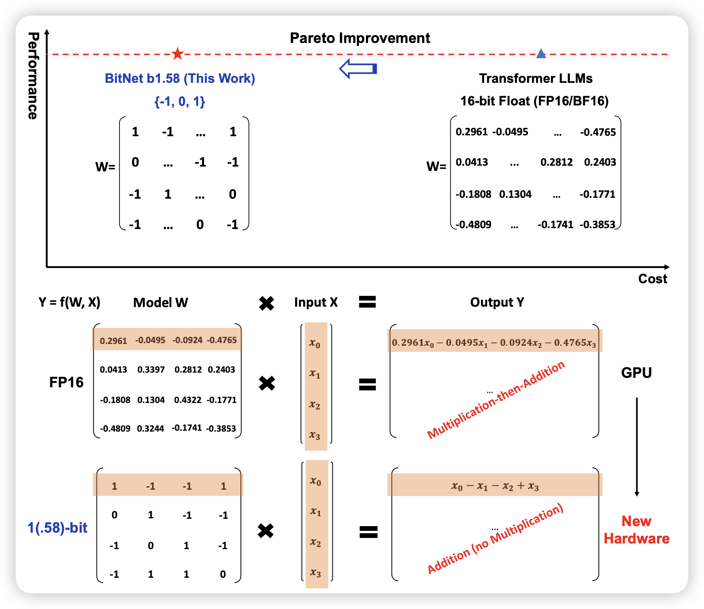

引用还能往下掉吗……

## [Retrieval is Accurate Generation](https://arxiv.org/pdf/2402.17532.pdf)

作者认为，之前的语言模型认为下一个token出自于一个固定的词表(实际上是把prefix编码，再和词表空间通过点乘获取logits，再根据softmax获取选词概率)。作者想的是，下一个token能不能出自于rag出来的某个n-gram？为了实现这个目的，在loss和训练任务上都得改。最终在很多事实任务上取得了非常好的效果

>  看之前没想到这么好玩……

## [Massive Activations in Large Language Models](https://arxiv.org/pdf/2402.17762.pdf)

meta的新研究。作者观察了llama中activation的原始数据，发现总会在一些层中有一些token的激活程度比别人大好几个数量级，占绝对优势。作者发现这个现象对于维持模型的表现至关重要。

## [The Era of 1-bit LLMs: All Large Language Models are in 1.58 Bits](https://arxiv.org/pdf/2402.17764.pdf)

如果大家还记得我之前分享过 BitNet，这次Furu Wei把他放宽到了1.58bit，即每个weight可能是[-1,0,1]。作者发现，这样训出来的模型表现和BF16模型几乎没有区别。另外，在这种情况下，实际上“矩阵乘法”是伪命题，因为只需要实现加法。这可以在硬件上极度加速运算速度

