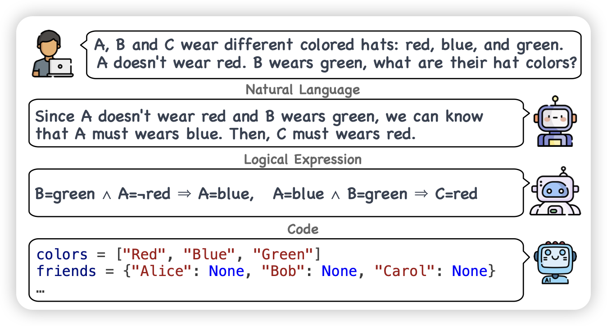
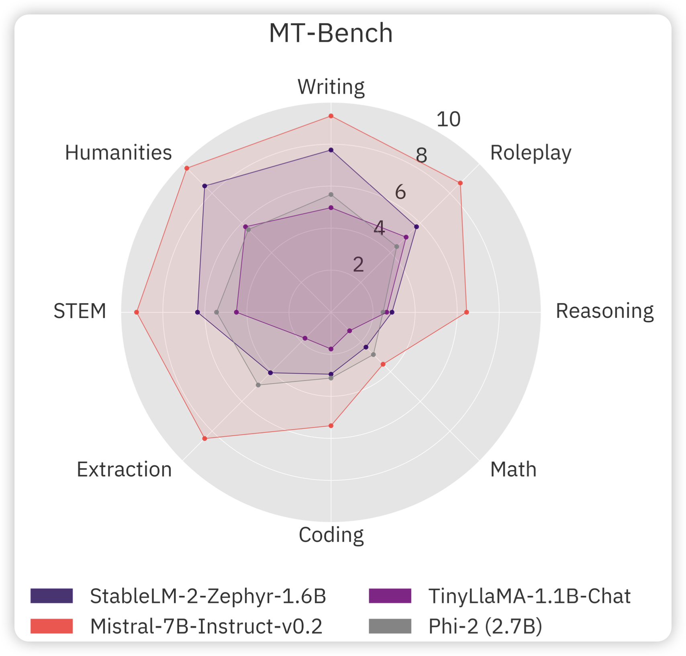

最近两周的论文都很多呀，SORA重新激起大家的热情了吗

## [Beyond Natural Language: LLMs Leveraging Alternative Formats for Enhanced Reasoning and Communication](https://arxiv.org/pdf/2402.18439.pdf)

推荐我们组的工作：作者发现，对于reasoning任务，实际上会有不同的组成形式。能不能在multi-agent框架下，使用不同的format去解决一个问题，然后通过讨论得出最终结论呢？

## [Stable LM 2 1.6B Technical Report](https://arxiv.org/pdf/2402.17834.pdf)

最新推出的1.6B小模型，大致训练了2T tokens，训练数据、细节等完全开源，宣称达到了SOTA的效果

