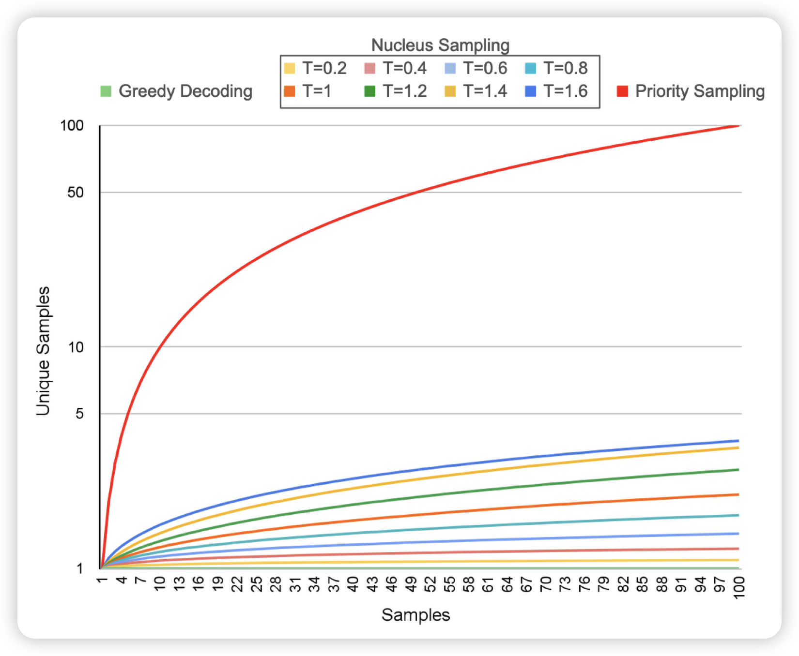
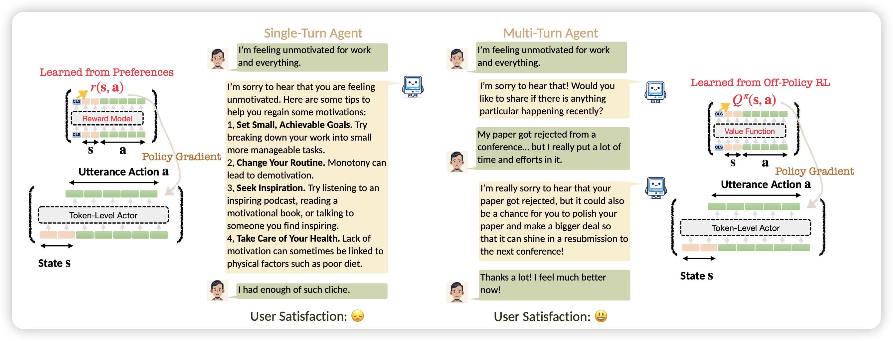

## [Priority Sampling of Large Language Models for Compilers](https://arxiv.org/pdf/2402.18734.pdf)

作者发现，场景的multi sample技术有一个怪圈：temperature小的时候全是一样的样本，temperature大的时候全是乱七八糟的样本。作者希望设计一套算法，可以在后面解码的时候再decoding算法层面做一些类似树形结构的优化，使得sample出来更多高质量的样本。

作者进行了尝试，并且取得了很不错的效果

## [ArCHer: Training Language Model Agents via Hierarchical Multi-Turn RL](https://arxiv.org/pdf/2402.19446.pdf)

Berkeley的工作。作者认为目前的RLHF更多关注单轮对话，对于多轮对话没有很好的建模方法。作者设计了一套适用于多轮对话的RL方法，并取得了相对不错的效果

