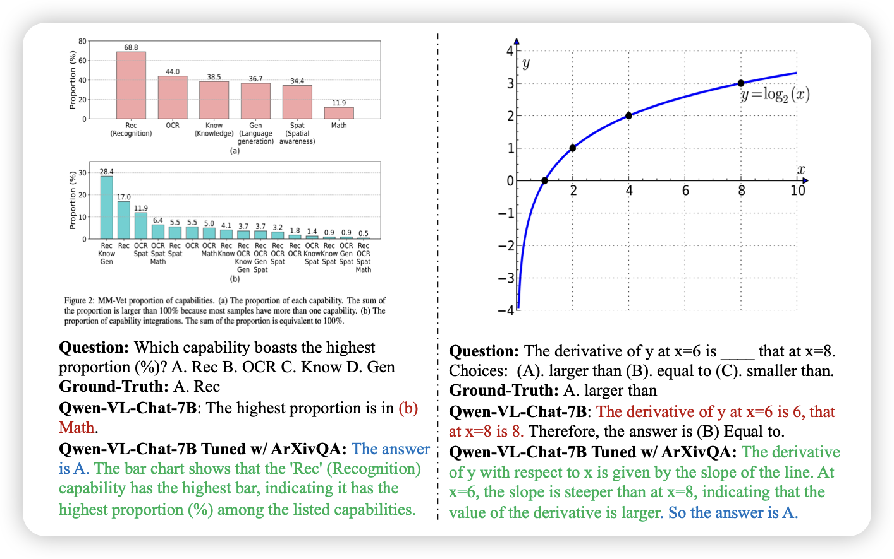

## [Multimodal ArXiv: A Dataset for Improving Scientific Comprehension of Large Vision-Language Models](https://arxiv.org/pdf/2403.00231.pdf)

作者发现，目前的MLLM虽然有vision能力，但是对于很精确很学术的内容分析能力并不强。所以作者基于6M的arxiv论文里的图片，用GPT-4V标注了一个arxiv论文图片的QA dataset，发现在这上面finetune的模型的能力极大的提高了

