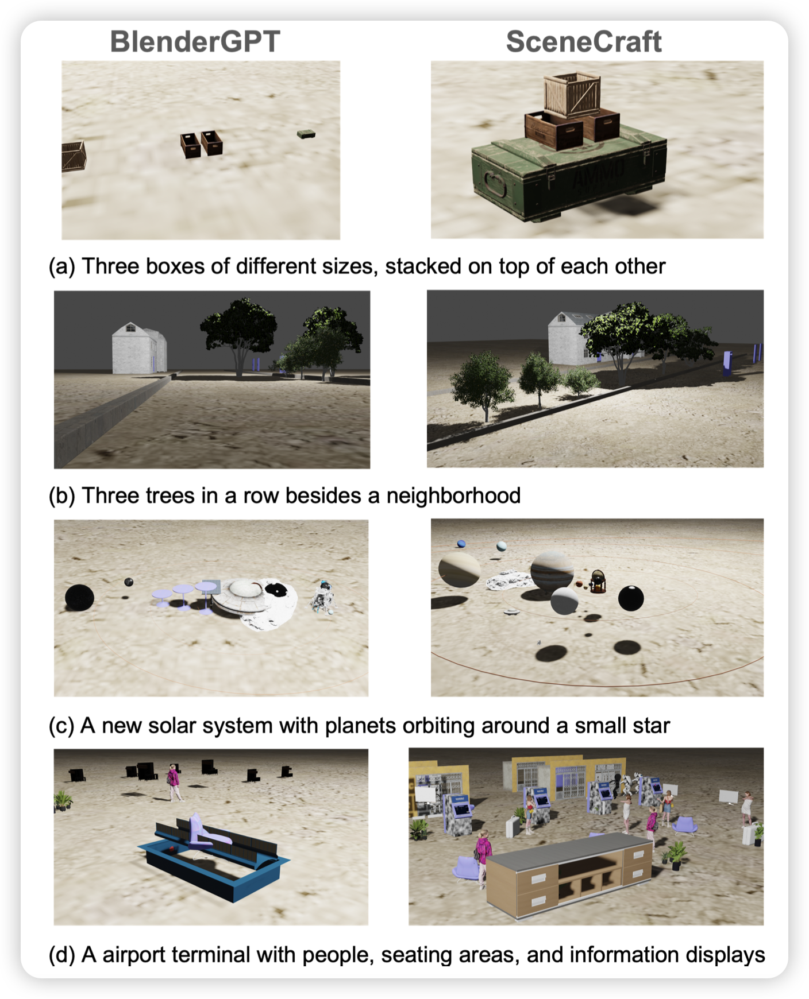
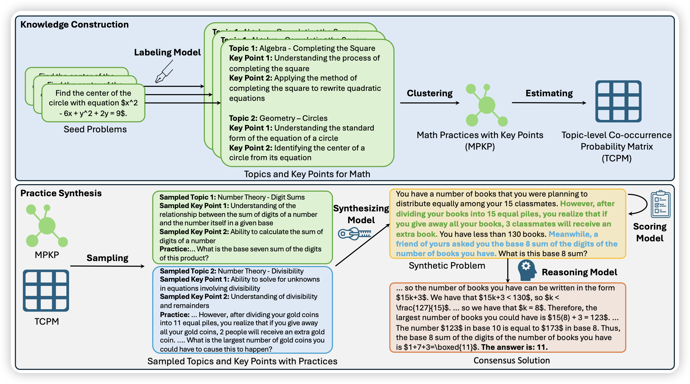

175篇论文……但神奇地感觉好玩的不多

## [SceneCraft: An LLM Agent for Synthesizing 3D Scene as Blender Code](https://arxiv.org/pdf/2403.01248.pdf)

deepmind参与的论文：作者尝试了能不能让模型把自然语言合成python代码，渲染出3d数据。然后经过一套pipeline设计，效果比原来的baseline好很多

> 难道说，可以用这招无限合成Sora训练数据了？

## [Key-Point-Driven Data Synthesis with its Enhancement on Mathematical Reasoning](https://arxiv.org/pdf/2403.02333.pdf)

Weizhu Chen的工作，他最近一直focus在怎么把知识体系划分成结构化，再由此由低到高构造数据。这篇，他们在math reasoning问题上做了尝试，先尝试把math场景做一个聚类，然后生成出来更加diverse的query。通过这样生成了1M的Q-A pair，由此直接finetune 7B模型可以在MATH上做到40% acc

