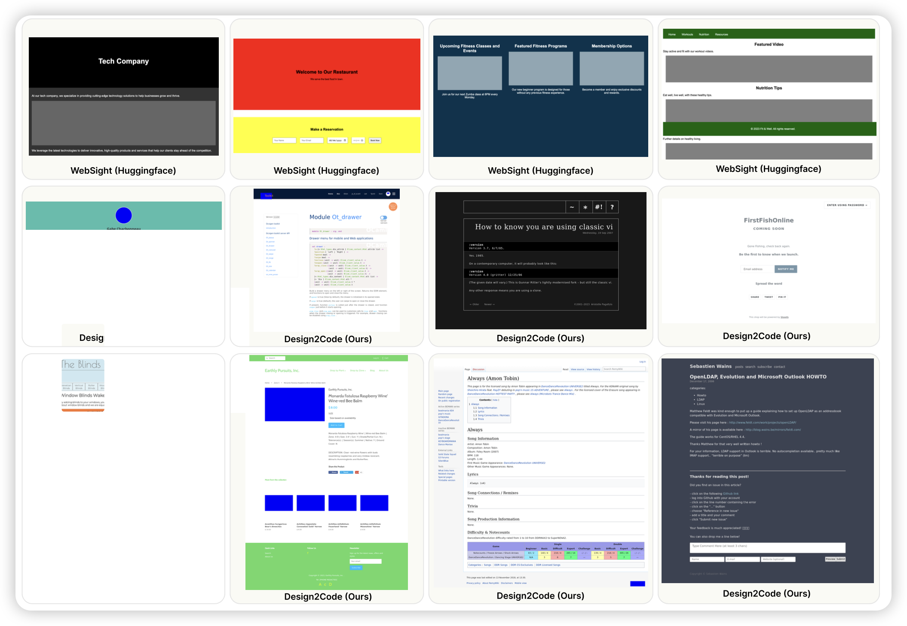

## [Android in the Zoo: Chain-of-Action-Thought for GUI Agents](https://arxiv.org/pdf/2403.02713.pdf)

给AITW标了18k CoT数据，由此finetune的200M模型效果超越了18B的CogAgent……

> CoT is all you need

## [MathScale: Scaling Instruction Tuning for Mathematical Reasoning](https://arxiv.org/pdf/2403.02884.pdf)

Furu Wei的论文：类似于昨天Weizhu Chen的论文，把数学场景按照topic分类，再层次化构造SFT数据，由此训模型，取得了巨好的效果

## [Design2Code: How Far Are We From Automating Front-End Engineering?](https://arxiv.org/pdf/2403.03163.pdf)

DIyi Yang的论文：作者探索了一个任务，人类给出网站的设计草图，模型能不能直接生成对应的html源码？作者在一个测试集上测试了GPT-4v、gemini Pro，发现实际上效果很好，Human认为64%的情况下比原始网站前端还好看，50%的情况可以在内容上直接取代原本的网页。接着，作者标了一个数据集训了一个18B模型，发现在这个任务上做的和Gemini Pro Vision一样好

> 话说就这个任务：是不是可以无限训一个草图生成模型，然后标注无穷无尽的数据，拿到 (html-草图)数据对

